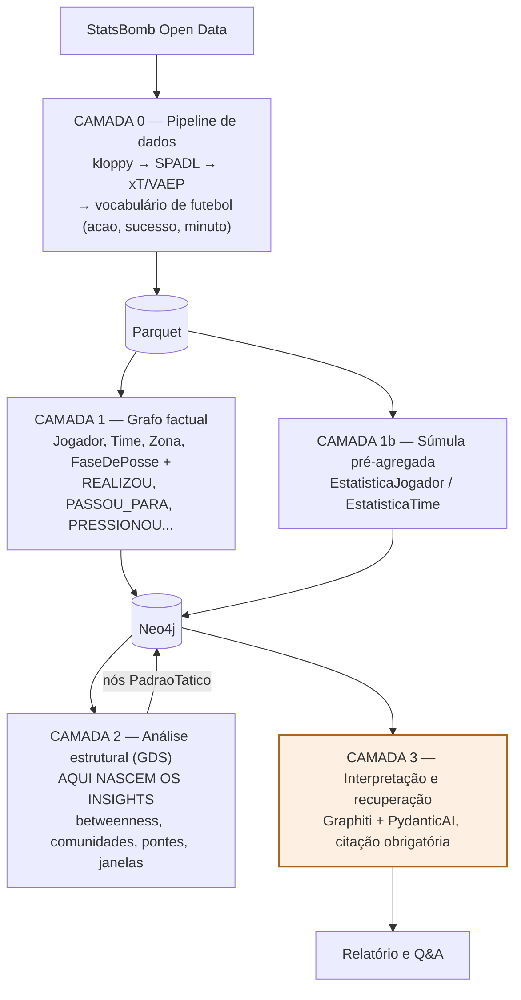

# football-tactics-knowledge-graph

PoC de **grafo tático de futebol com insights não triviais**: dados de evento
(StatsBomb Open Data) passam por uma pipeline determinística, viram um grafo em Neo4j, e
algoritmos de grafo (GDS) produzem insights que **não existem em nenhuma linha da tabela**
— o LLM (Graphiti + PydanticAI) apenas verbaliza e recupera, nunca calcula.

> **Novo por aqui?** Comece por
> **[docs/00-entenda-o-projeto.md](docs/00-entenda-o-projeto.md)** — explica do
> zero de onde vem o dado e o que cada transformação faz, acompanhando o gol
> do Di María na final da Copa de 2022 da origem até a resposta.

## Arquitetura



**Só a camada 3 usa LLM.** Todo número nasce nas camadas determinísticas; o
modelo lê, consulta e escreve — nunca calcula.


## Quickstart

```bash
cp .env.example .env                                  # 1. configurar (chaves de LLM opcionais)
docker compose up -d                                  # 2. Neo4j (GDS+APOC) + API
docker compose exec api python scripts/run_pipeline.py   # 3. camada 0
docker compose exec api python scripts/build_graph.py    # 4. camada 1
docker compose exec api python scripts/run_analysis.py   # 5. camada 2 (insights)
# camada 3: GET /report/{match_id} e POST /ask em localhost:8000 (exige LLM_API_KEY)
```

## Documentação

| Doc | Conteúdo |
|---|---|
| [docs/00-entenda-o-projeto.md](docs/00-entenda-o-projeto.md) | **comece aqui**: o projeto do zero — uma jogada real do JSON bruto ao grafo, e uma pergunta real do enunciado à resposta conferida |
| [docs/01-pipeline.md](docs/01-pipeline.md) | linhagem completa StatsBomb → grafo, com contagens reais |
| [docs/02-modelo-grafo.md](docs/02-modelo-grafo.md) | schema do grafo, projeções do GDS, volumes medidos |
| [docs/03-insights.md](docs/03-insights.md) | catálogo dos 8 insights, com exemplos reais das partidas |
| [docs/04-consumo.md](docs/04-consumo.md) | relatório, Q&A, prompts na íntegra, recuperação estruturada |
| [docs/05-decisoes.md](docs/05-decisoes.md) | ADRs (por que a camada 1 não usa LLM, etc.) |
| [docs/06-reproduzir.md](docs/06-reproduzir.md) | passo a passo do zero, com saídas esperadas |
| [docs/07-validacao.md](docs/07-validacao.md) | relatório da execução de validação: todos os números medidos, separados da doc |
| [docs/08-autonomia.md](docs/08-autonomia.md) | o processo do modo autônomo: text-to-Cypher read-only no relatório e no Q&A, bugs reais e regras |
| [docs/09-a-avaliacao-por-dentro.md](docs/09-a-avaliacao-por-dentro.md) | **como a avaliação funciona**: os três braços, o que cada métrica mede, como rodar, quanto custa e como restaurar o backup do índice |
| [docs/10-roteiro-de-testes.md](docs/10-roteiro-de-testes.md) | **para testar na mão e entender o app**: 28 casos com comando, resultado esperado (conferido contra o grafo) e como validar — do Neo4j Browser a perguntas que tentam fazer o app errar |

Dados: [StatsBomb Open Data](https://github.com/statsbomb/open-data) (CC BY-NC 4.0, uso
acadêmico com atribuição). Partidas da PoC: Copa do Mundo 2022 — final, semifinal e quartas.
