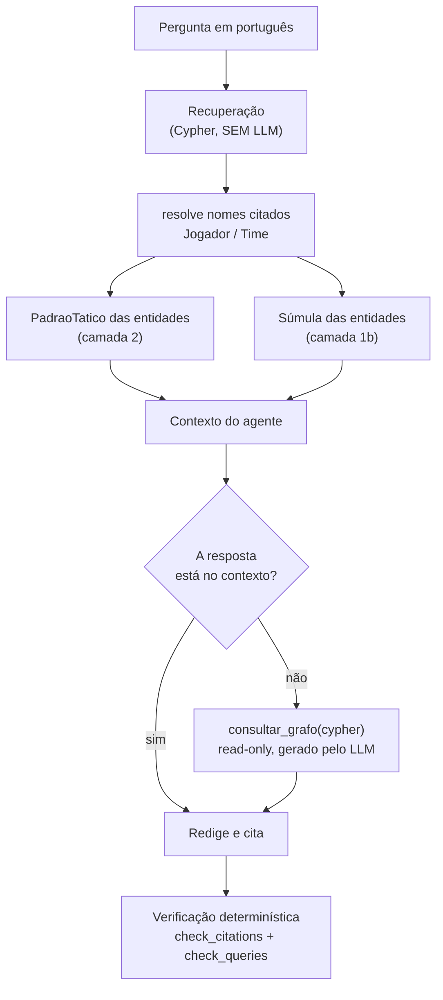
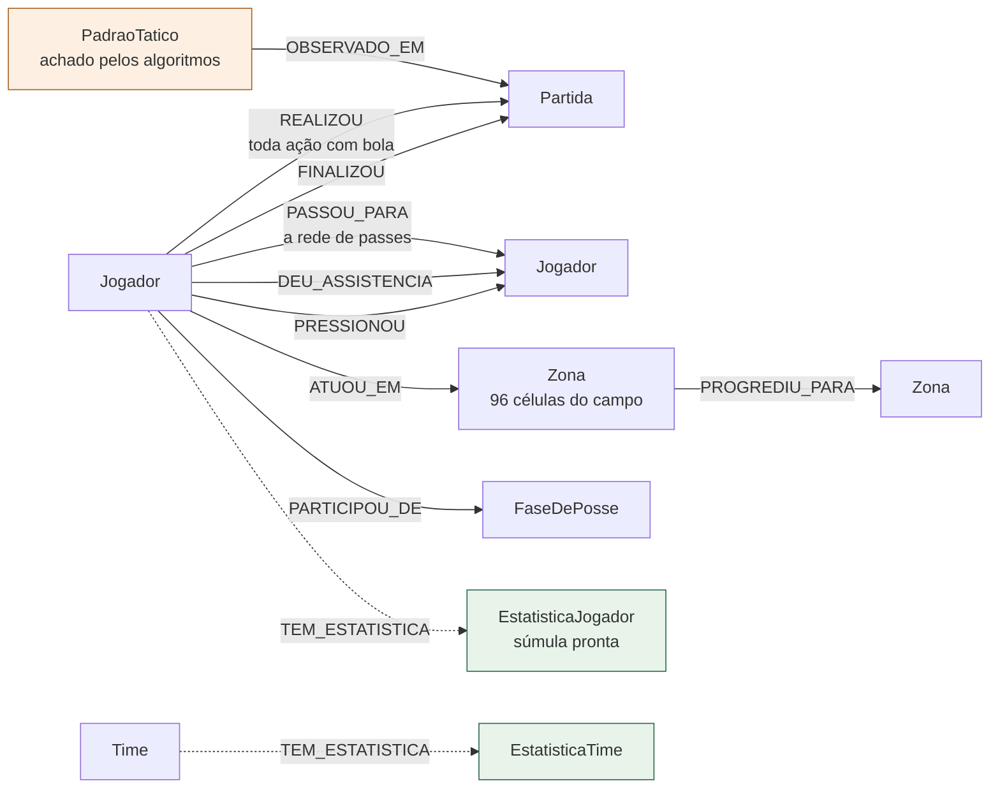
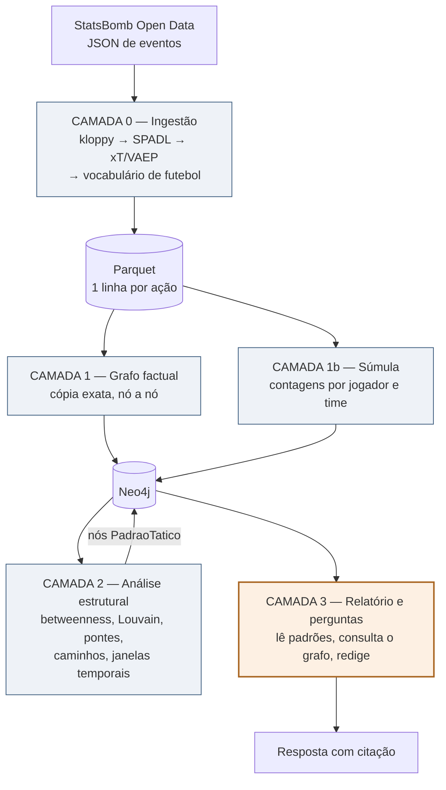

# 00 — Entenda o projeto do zero

Este documento é para quem chega sem contexto. Ele explica **de onde vem o
dado, o que cada transformação faz com ele e por que**, seguindo uma jogada
real do começo ao fim. Os outros documentos (`01` a `08`) são referência
detalhada; este é a explicação.

---

## 1. O que o projeto faz

Dados de futebol vêm como uma lista de eventos: "no minuto 35 e 22 segundos,
Di María chutou da posição (111.8, 32.1) e foi gol". É uma planilha gigante
de fatos isolados.

Perguntas de tática não são sobre fatos isolados. São sobre **relações**:

- "Por qual jogador passavam os caminhos de progressão do time?"
- "Se eu pressionar um jogador só, o time adversário fica sem saída de bola?"
- "O time mudou de postura no meio do jogo? Quando?"

Nenhuma dessas se responde somando colunas, porque a resposta está na forma
da rede de passes, não nos totais. Este projeto transforma a lista de eventos
num **grafo**, roda algoritmos de rede sobre ele para achar esses padrões, e
deixa um LLM consultar o resultado para escrever relatórios e responder
perguntas — sempre citando de onde tirou cada número.

---

## 2. Uma jogada inteira, do começo ao fim

Vamos seguir o **gol do Di María na final da Copa de 2022** (36 minutos) por
todas as etapas. Todos os números abaixo são reais, extraídos do projeto.

### 2.1 O que o StatsBomb entrega (dado bruto)

O ponto de partida é um JSON com um objeto por evento:

```json
{
  "period": 1, "minute": 35, "second": 22,
  "type":   { "name": "Shot" },
  "team":   { "name": "Argentina" },
  "player": { "name": "Ángel Fabián Di María Hernández" },
  "location": [111.8, 32.1],
  "shot": {
    "statsbomb_xg": 0.303,
    "end_location": [120.0, 41.7, 0.5],
    "body_part": { "name": "Left Foot" },
    "outcome":   { "name": "Goal" },
    "freeze_frame": [ ...posição de todos os jogadores visíveis... ]
  }
}
```

Três coisas a notar, porque explicam decisões do resto do projeto:

- **`minute` é o minuto decorrido, começando em zero.** `minute: 35` é o gol
  que todo mundo viu como "aos 36 minutos". A diferença de 1 aparece de novo
  mais adiante.
- **A coordenada é um campo de 120x80** unidades, com origem no canto
  superior esquerdo.
- **Nem todo evento é uma ação com bola.** Além de passes e chutes, o arquivo
  tem recepções de bola, pressões, escalação inicial, substituições. São
  4.527 eventos na final inteira.

### 2.2 kloppy: tirar o dado do formato do fornecedor

O [kloppy](https://kloppy.pysport.org/) lê esse JSON e devolve um modelo de
eventos que não depende do StatsBomb. Serve para que trocar de fornecedor
(Wyscout, Opta) não obrigue a reescrever o projeto inteiro. Nesta etapa nada
é descartado nem calculado.

### 2.3 SPADL: reduzir tudo a um vocabulário só

O [SPADL](https://socceraction.readthedocs.io/) (Decroos et al., KDD 2019)
converte todo evento numa mesma estrutura:

> *(jogador, time, tipo, x inicial, y inicial, x final, y final, resultado, tempo)*

e faz duas normalizações importantes:

- Campo padrão de **105x68 metros**.
- **Os dois times atacam da esquerda para a direita.** Sem isso, comparar
  "onde o time construiu" entre os dois lados exigiria espelhar as
  coordenadas o tempo todo.

Nosso gol vira esta linha:

| campo SPADL | valor |
|---|---|
| `type_name` | `shot` |
| `result_name` | `success` |
| `start_x`, `start_y` | 97.44, 41.28 |
| `end_x`, `end_y` | 104.95, 32.49 |
| `period_id` | 1 |
| `time_seconds` | 2122.65 |

O SPADL **descarta o que não é ação com bola**: dos 4.527 eventos da final
sobram 2.584 ações. Isso é definição do formato, não perda acidental — mas
duas dessas perdas importam para nós e são recuperadas depois (seção 2.6).

### 2.4 Valorar cada ação: xT e VAEP

Contar passes não diz quem fez o time progredir. Duas métricas resolvem isso
de ângulos diferentes.

**xT (Expected Threat)** — *quanto essa ação aproximou o time do gol?*

O campo é dividido numa grade de 12x8 células. Cada célula tem um valor: a
probabilidade de o time marcar nos próximos lances tendo a bola ali. O xT de
uma ação é a **diferença** entre o valor da célula de destino e o da origem.

> Intuição: levar a bola do meio-campo para a entrada da área vale muito;
> tocar de lado na defesa vale quase nada. Ações que não movem a bola com
> sucesso recebem 0 — ausência de progressão é zero, não dado faltante.

**VAEP** — *quanto essa ação mudou a chance de o jogo terminar em gol?*

Dois classificadores estimam, a cada ação, a probabilidade de o time marcar e
de sofrer nas próximas 10 ações. O VAEP é a diferença entre as duas variações.

> Diferença prática para o xT: o VAEP enxerga **ações defensivas e erros**, e
> leva em conta o contexto da sequência. O xT só olha para o deslocamento da
> bola.

O chute do Di María tem `xt_value = 0.0` (um chute não move a bola para uma
zona melhor — ele encerra a jogada) e `vaep_value = 0.107`. É o esperado: o
xT valoriza quem **leva** a bola até ali; o VAEP valoriza o desfecho.

### 2.5 Contexto: zona, fase de posse, progressão

- **Zona** — a mesma grade 12x8 do xT, numerada de 0 a 95 (`zona = coluna*8 +
  linha`). Cada zona ganha dois rótulos legíveis: **terço** (defesa, meio,
  ataque) e **corredor** (esquerda, centro, direita).
- **Fase de posse** — sequência ininterrupta de ações do mesmo time. Começa
  uma nova quando a posse troca, o período muda, ou depois de falta,
  finalização, defesa do goleiro ou corte.
- **Progressivo** — marca a ação que aproxima a bola do gol adversário acima
  de um limiar que depende de onde ela acontece (30 m no campo próprio, 15 m
  cruzando o meio, 10 m no campo adversário — definição do Wyscout).

Aqui a jogada do gol fica visível inteira. Esta é a **fase de posse 132**,
como o projeto a registra:

| # | jogador | ação | zona → zona | terço | xT |
|---|---|---|---|---|---|
| 703 | Molina | passe | 16 → 33 | defesa | 0.0002 |
| 704 | Mac Allister | passe | 33 → 41 | meio | 0.0004 |
| 705 | Messi | condução | 41 → 41 | meio | 0 |
| 706 | Messi | passe | 41 → 49 | meio | 0.0011 |
| 707 | Álvarez | condução | 49 → 49 | meio | 0 |
| 708 | Álvarez | passe | 49 → 74 | meio | 0.0113 |
| 709 | Mac Allister | passe | 74 → 92 | ataque | **0.0703** |
| 710 | Di María | finalização | 92 → 91 | ataque | 0 |

8 ações, 5 jogadores, cerca de 10 segundos, da zona 16 (defesa) à zona 92
(ataque). O xT conta a história sozinho: os toques de saída valem quase nada,
e o passe do Mac Allister para a área vale **0.070 — mais que todos os
anteriores somados**. Foi ele que criou o gol, e nenhuma contagem de passes
mostraria isso.

### 2.6 Traduzir para o vocabulário do futebol

Até aqui o dado fala SPADL, que é um formato de pesquisa em inglês. Três
armadilhas vinham daí:

| Armadilha | Consequência real |
|---|---|
| `dribble` significa **condução**, não drible. Drible é `take_on`. | Na final há 1005 conduções e 54 dribles. Confundir erra por 20x. |
| `tackle` conta tentativas e acertos juntos | O sistema respondeu "Enzo fez 9 desarmes"; a resposta é 5. O ranking inteiro muda. |
| `time_seconds` reinicia a cada período | O gol do Mbappé aos 80 ficava gravado como "minuto 34.4" |

A decisão do projeto é **resolver isso no dado, não no prompt**. Cada ação
ganha:

- **`acao`** — o nome em português, de um vocabulário fechado: `passe`,
  `cruzamento`, `conducao`, `drible`, `desarme`, `interceptacao`, `corte`,
  `finalizacao`, `penalti`, `falta_cometida`, `defesa_do_goleiro`... Sem
  acentos, para ninguém errar a consulta por causa de cedilha.
- **`sucesso`** — booleano explícito. "Desarme certo" é
  `acao = 'desarme' AND sucesso`, e ponto.
- **`minuto`** — o minuto da transmissão, já com o período embutido (o 2º
  tempo começa em 45, a prorrogação em 90 e 105). Os seis gols da final saem
  aos **23, 36, 80, 81, 108 e 118**, iguais à súmula da FIFA.
- **`segundo`** — segundos desde o apito inicial. `minuto` é para **ler**;
  `segundo` é para **comparar** (ver seção 8, "Limites conhecidos").
- **`gol`**, **`cartao_amarelo`**, **`terco`**, **`corredor`**.

Nesta etapa também se recupera do JSON bruto **o que o SPADL joga fora**:

- **O desfecho da finalização.** O SPADL só guarda gol/não-gol. O StatsBomb
  distingue defendida, para fora, bloqueada e na trave — sem isso, "quantas
  finalizações no gol?" não teria resposta.
- **Cartões que não vieram de falta.** O SPADL só enxerga cartão anexado a
  uma falta com bola em jogo. A final teve **7 amarelos em campo** e o grafo
  registrava 6: faltava o do Giroud aos 95', que foi por reclamação.

Nosso gol, depois desta etapa: `acao = finalizacao`, `sucesso = True`,
`minuto = 36`, `gol = True`, `desfecho = gol`, `terco = ataque`,
`corredor = centro`.

### 2.7 O grafo

Cada linha vira nó e aresta, sem nenhuma chamada de LLM — é cópia
determinística, então não há risco de invenção. O gol vira:

```
(Di María)-[:FINALIZOU {minuto: 36, acao: 'finalizacao', gol: true,
                        desfecho: 'gol', zona: 92}]->(Final)
```

e a jogada inteira vira uma cadeia de `PASSOU_PARA` dentro da mesma
`FaseDePosse`, com `Mac Allister -[:DEU_ASSISTENCIA]-> Di María`.

### 2.8 Os algoritmos de rede

Com o grafo pronto, rodam algoritmos de teoria dos grafos — **sem LLM
nenhum**. Cada padrão encontrado vira um nó `PadraoTatico` com o número, o
algoritmo que o produziu e uma descrição. É a etapa que produz as respostas
que não existiriam numa planilha (detalhe em `03-insights.md`).

### 2.9 A resposta

Só agora entra o LLM, e num papel estreito: ele **não calcula nada**. Ele lê
os padrões prontos, escreve consultas somente-leitura ao grafo quando precisa
de um fato, e redige. Cada número da resposta aponta para o padrão ou para a
consulta que o produziu.

---

## 3. Uma pergunta inteira, do começo ao fim

A seção anterior seguiu o **dado entrando**. Esta segue uma **pergunta saindo**.
Tudo aqui é saída real do sistema, registrada na avaliação de 2026-08-25
(`data/processed/eval_results.json`) — inclusive os defeitos, que são a parte
mais instrutiva.



### 3.1 O caminho curto: quando a resposta já existe

> *"Qual jogador foi o gargalo estrutural da progressão da Argentina na final?"*

1. A recuperação extrai os candidatos a nome próprio da frase e resolve
   **"Argentina"** contra os nós `Time`. Sem LLM, **0,019 segundos**.
2. Busca os `PadraoTatico` que envolvem essa entidade. O pivô já está lá — o
   GDS calculou o betweenness na camada 2, **antes de alguém perguntar**.
3. O agente lê o padrão e redige, citando o `uid` dele.

Resultado real: **recuperação 5/5, insight 5/5, zero consultas Cypher.**

> "O gargalo estrutural da progressão argentina é Nicolás Hernán Otamendi. Ele
> apresenta a maior betweenness centrality do time (50.0, o dobro do segundo
> colocado, com 25.0), acumulando 143 ações e pageRank de 1.622 — ou seja, é o
> ponto por onde a maior parte dos caminhos de passe que conectam defesa e
> ataque da Argentina passa."

É o caminho que justifica o projeto inteiro: a resposta **não foi calculada na
hora**, ela já existia como nó no grafo, e o LLM só a verbalizou.

### 3.2 O caminho longo: quando é preciso consultar

> *"Quem fez os gols da final?"*

Aqui nenhum padrão ajuda — algoritmo de rede não calcula gol. O agente escreve
o próprio Cypher (`consultar_grafo`), que roda em transação somente-leitura e
fica registrado na resposta. Foi **1 consulta**, e a resposta saiu correta:

> "1º tempo: Lionel Messi (Argentina), pênalti, aos 22min; Ángel Di María
> (Argentina), aos 35min. 2º tempo: Kylian Mbappé (France), pênalti, aos 34min;
> Kylian Mbappé (France), aos 36min. Prorrogação: Lionel Messi (Argentina), aos
> ~3min do período 4; Kylian Mbappé (France), pênalti, aos ~12min do período 4."

**Duas coisas para notar — e as duas já foram corrigidas.**

**Os minutos estavam na convenção errada.** "Aos 22min", "aos 34min do 2º
tempo", "aos ~3min do período 4" — o relógio reiniciava a cada período, então
ninguém reconhece o próprio jogo que assistiu. Hoje o grafo devolve **23', 36',
80', 81', 108' e 118'**, batendo com a súmula da FIFA (seção 2.6).

**A nota 1/5 em recuperação não é erro de resposta.** O juiz da avaliação
pontua o **contexto recuperado**, não o texto final. E o contexto, nesta
pergunta, tinha caído no `fallback_todos_padroes`: padrões de pressão e de
comunidade, nada sobre gols. A resposta estava certa; o contexto que a
sustentava é que estava vazio de fato relevante. Hoje a súmula entra no
contexto (`api/retrieval.py`), e uma pergunta que cite um jogador recebe os
números dele antes de qualquer consulta.

### 3.3 O que o baseline respondeu à mesma pergunta

> "Não é possível responder com os dados disponíveis. O contexto fornecido
> contém apenas estatísticas táticas agregadas (passes, PPDA, field tilt, xT,
> VAEP) das partidas, mas não menciona quem marcou os gols em nenhuma delas."

Leia com atenção, porque é fácil ler errado. O baseline **não errou de
raciocínio** — ele foi honesto sobre não ter o dado. Vencer essa pergunta não
prova nada sobre grafos: prova que um lado tinha a informação e o outro não.

Era um desequilíbrio do experimento, e foi corrigido: o resumo do baseline
agora carrega os mesmos fatos que o grafo (gols, cartões, desarmes, dribles,
defesas — `evaluation/match_facts.py`). O que sobra de diferença entre os dois
sistemas passa a ser a **representação**, que é a variável que a pesquisa quer
isolar. Nas perguntas estruturais o baseline continua sem ter como responder —
mas aí por um motivo real, e não por falta de dado.

### 3.4 Depois da resposta: o que é conferido

Duas checagens determinísticas, sem LLM:

- **`check_citations`** — toda métrica citada aponta para um `PadraoTatico` que
  existe, com o mesmo valor, nome e algoritmo de origem?
- **`check_queries`** — toda consulta registrada roda de novo e devolve linhas?

E uma ressalva que precisa vir junto: **as duas passando não significa que a
resposta está certa.** A pergunta dos desarmes tirou fidelidade 1.0 respondendo
"Enzo 9" quando são 5 — o número veio mesmo da consulta, e era a consulta que
perguntava outra coisa. Verificação automática não pega erro semântico de
consulta. Quem pega é o dado não ser ambíguo (`desarmes_certos` separado de
`desarmes_tentados`) e o `scripts/check_golden_queries.py`, que compara com
resposta conferida à mão.


---

## 4. O que cada número significa

Resumo em português direto das métricas que aparecem nas respostas.

| Métrica | O que mede | Como ler |
|---|---|---|
| **xT** | quanto a ação aproximou o time do gol | quanto maior, mais a ação fez a bola progredir para uma zona perigosa |
| **VAEP** | quanto a ação mudou a probabilidade de gol (a favor menos contra) | enxerga ação defensiva e erro, que o xT ignora |
| **PPDA** | passes que o adversário completa antes de sofrer uma ação defensiva | **quanto MENOR, mais o time pressiona.** 8 a 14 é o normal na elite |
| **Field tilt** | fatia dos passes no terço final que são do time | 50% é equilíbrio; acima disso é domínio territorial |
| **Betweenness** | quantos caminhos curtos da rede de passes atravessam um jogador | alto = **gargalo**: se ele for anulado, o time perde ligação. Não é o que mais toca na bola |
| **PageRank** | prestígio na rede: recebe de quem recebe muito | serve de contraste com betweenness — são coisas diferentes |
| **Louvain** | agrupa jogadores que trocam mais passes entre si | revela as "linhas reais" do time, que podem não bater com a escalação |
| **Ponte** | ligação que, removida, desconecta a rede em dois blocos | é onde uma pressão dirigida quebra a saída de bola |

O ponto do PPDA merece ênfase porque é contraintuitivo: **número baixo é
pressão alta**. PPDA 5.2 é um time sufocando; PPDA 30 é um time esperando.

---

## 5. O que tem dentro do grafo



As caixas verdes são as **súmulas** (camada 1b, contagens já somadas) e a
laranja é o **padrão tático** (camada 2, achado por algoritmo de rede). O
resto é o registro literal do que aconteceu em campo. Propriedades completas
em `02-modelo-grafo.md`.

**Nós**

| Nó | É |
|---|---|
| `Jogador`, `Time`, `Partida` | identificação |
| `Zona` | uma das 96 células do campo, com terço e corredor |
| `FaseDePosse` | uma sequência ininterrupta de posse |
| `EstatisticaJogador` | a súmula de um jogador na partida, tudo já somado |
| `EstatisticaTime` | a súmula de um time na partida |
| `PadraoTatico` | um padrão achado pelos algoritmos de rede |

**Arestas**

| Aresta | É |
|---|---|
| `REALIZOU` | o log completo: uma aresta por ação com bola |
| `PASSOU_PARA` | a rede de passes (só passes certos, com recebedor identificado) |
| `FINALIZOU` | uma aresta por finalização |
| `DEU_ASSISTENCIA` | uma aresta por gol assistido |
| `PRESSIONOU` | a rede de pressão |
| `ATUOU_EM` | quanto o jogador agiu em cada zona |
| `PROGREDIU_PARA` | fluxo de bola entre zonas |

### Por que existem as súmulas prontas

`EstatisticaJogador` guarda `desarmes_certos` **e** `desarmes_tentados` como
campos separados, `dribles_certos` e `dribles_tentados`, `passes_certos`,
`precisao_passe_pct`, `gols`, `assistencias`, `finalizacoes_no_gol` e assim
por diante. "Quem fez mais desarmes na final?" vira:

```cypher
MATCH (e:EstatisticaJogador {match_id: 3869685})
RETURN e.nome, e.desarmes_certos
ORDER BY e.desarmes_certos DESC LIMIT 3
```

Sem agregação, sem decisão ambígua, sem conhecimento prévio. Era exatamente
essa decisão ambígua — tentativa ou acerto? — que produzia a resposta errada.

As súmulas são calculadas **em Cypher, sobre as mesmas arestas** que uma
consulta ad-hoc percorreria. Se fossem calculadas em Python, uma diferença
sutil de filtro faria a súmula discordar de uma contagem manual: duas
respostas certas e incompatíveis, que é pior que nenhuma.

---

## 6. As quatro camadas



**A caixa laranja é a única que usa LLM.** Tudo que é número nasce nas caixas
azuis, por código determinístico.

| Camada | O que faz | Usa LLM? |
|---|---|---|
| **0 — Ingestão** | StatsBomb → kloppy → SPADL → xT/VAEP → português → Parquet | não |
| **1 — Grafo factual** | Parquet → nós e arestas no Neo4j, cópia exata | não |
| **1b — Súmula** | contagens por jogador e por time | não |
| **2 — Análise estrutural** | algoritmos de rede → nós `PadraoTatico` | **não** |
| **3 — Relatório e perguntas** | lê padrões, consulta o grafo, redige | sim |

A regra que sustenta a confiabilidade: **os insights nascem na camada 2, sem
LLM.** O LLM da camada 3 lê números prontos e escreve texto. Quando ele
precisa de um fato que não está nos padrões, ele escreve uma consulta
somente-leitura — e ela fica registrada na resposta, para poder ser
reexecutada e conferida.

---

## 7. Como conferir tudo isso sem gastar nada

```bash
python scripts/check_golden_queries.py
```

Roda a consulta de referência das 30 perguntas do golden dataset contra o
grafo e imprime, lado a lado, a resposta esperada e o que o grafo devolve.
Não usa LLM e não consome API. Se uma pergunta ficar sem linhas, o defeito é
do modelo de dados.

Para ver o schema que o agente enxerga — que é **lido do banco**, não escrito
à mão:

```python
from football_graphrag.config import get_settings
from football_graphrag.graph import db, schema
print(schema.describe_graph(db.make_driver(get_settings())))
```

---

## 8. Limites conhecidos (leia antes de confiar num número)

- **A disputa de pênaltis não está no grafo.** O período 5 é excluído: não há
  tática de posse ou pressão a modelar. Por isso o grafo diz 3x3 na final, e
  o 8º cartão da partida (Emiliano Martínez) não aparece.
- **Minutos se sobrepõem entre períodos.** Nos acréscimos o 1º tempo pode
  chegar ao minuto 52 enquanto o 2º começa no 46. É o comportamento correto
  do futebol, não um defeito. Para ordenar cronologicamente use `action_id`
  ou `segundo`, nunca `minuto`.
- **`PASSOU_PARA` não é o total de passes.** Ela só tem passes certos com
  recebedor identificado — é a rede de passes, insumo dos algoritmos. O total
  de passes está em `EstatisticaJogador.passes_tentados`.
- **`minuto` não serve para janela temporal.** É inteiro e por período.
  Comparações de tempo usam `segundo`. Ignorar isso já produziu um bug real:
  o insight de gatilho de pressão comparava minuto-do-período com
  minuto-absoluto, e a janela de 8 segundos nunca fechava do 2º tempo em
  diante.
- **Três partidas, um torneio.** Nada aqui foi validado fora do mata-mata da
  Copa de 2022.
- **O `xt_value` sai de uma grade ajustada localmente** sobre 16 partidas do
  mata-mata, não da grade pública do Karun Singh (que é usada
  automaticamente se colocada em `data/models/`).

---

## 9. Para onde ir depois

| Documento | Assunto |
|---|---|
| `01-pipeline.md` | cada passo da ingestão, com contagens reais |
| `02-modelo-grafo.md` | nós, arestas e propriedades em detalhe |
| `03-insights.md` | os oito padrões da camada 2, com exemplos reais |
| `04-consumo.md` | API e endpoints |
| `05-decisoes.md` | as decisões de arquitetura e por quê |
| `06-reproduzir.md` | como rodar do zero |
| `07-validacao.md` | avaliação contra o baseline vetorial |
| `08-autonomia.md` | como o LLM escreve o próprio Cypher |
