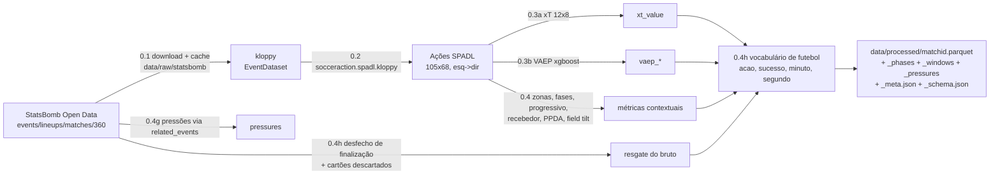

# 01 — Pipeline de dados (Camada 0)

Pipeline determinística, sem LLM: StatsBomb JSON → kloppy → SPADL → xT/VAEP → métricas →
vocabulário de futebol → Parquet.
Contrato duro: **a partir do parquet, nada mais é calculado**. Camadas 1–3 apenas leem.

> Se este é seu primeiro contato com o projeto, leia antes
> `00-entenda-o-projeto.md`: ele acompanha uma jogada real por todas as etapas
> abaixo e explica o que cada métrica significa. Este documento é a referência
> passo a passo.

## Fluxo

## Passo 0.1 — Aquisição (`ingestion/statsbomb_loader.py`)

- Fonte: `https://raw.githubusercontent.com/statsbomb/open-data` (CC BY-NC 4.0, uso acadêmico).
- Partidas ingeridas (Copa do Mundo 2022, com dados 360):
  - **3869685** Argentina x França (final) — 4.527 eventos kloppy
  - **3869519** Argentina x Croácia (semifinal) — 3.891 eventos
  - **3869354** Inglaterra x França (quartas) — 3.351 eventos
- Cache em `data/raw/statsbomb/` no layout do repositório open-data; nunca rebaixa se existir.
- O kloppy normaliza os eventos num modelo agnóstico de fornecedor. **Disputa de pênaltis
  (período 5) é excluída** — não é jogo corrido, não há tática de posse/pressão a modelar.
- O que o 360 traz a mais: *freeze frames* com posição de todos os jogadores visíveis no
  momento do evento. Nesta PoC os arquivos 360 são baixados e cacheados, mas não entram no
  grafo (ficam como extensão futura documentada; nenhum insight da seção 7 depende deles).

Contagem real da final (top tipos kloppy): pass 1.263, ball receipt 1.114, carry 940,
**pressure 361**, duel 147, recovery 115, ...

## Passo 0.2 — Normalização SPADL (`ingestion/spadl_transform.py`)

SPADL (Decroos et al., KDD 2019) unifica toda ação com bola em
`(jogador, time, tipo, x_i, y_i, x_f, y_f, resultado, tempo)`, campo 105x68 m,
**ataque sempre da esquerda para a direita para os dois times**.

Contagens reais da final: **4.527 eventos kloppy → 2.584 ações SPADL (1.943 descartados)**.
O descarte é por definição do SPADL, não perda acidental:

| Descartado | Motivo |
|---|---|
| Ball Receipt (1.114) | recepção é consequência do passe, não ação própria |
| Pressure (361) | não é ação com bola — **recuperado no passo 0.4g** como artefato próprio |
| Block, Foul Won, Dispossessed, Dribbled Past... | viram o `result` da ação do adversário |
| Starting XI, Half Start/End, substituições, cartões | metadados, não ações |

Distribuição SPADL da final: pass 1.103, dribble (condução) 1.005, tackle 57, take_on 54,
throw_in 48, foul 48, clearance 46, interception 42, shot 27+3 pênaltis, cross 24, ...

Ids do kloppy são strings; normalizamos para inteiros StatsBomb para casar com os loaders
do socceraction (única transformação deste passo, sem perda).

## Passo 0.3 — Valoração de ações

**xT** (Karun Singh, 2018) valora a *progressão espacial*: diferença de valor entre a
célula de destino e a de origem numa grade 12x8 do campo. Bom para valorar quem move a
bola para zonas perigosas, mesmo sem participar da finalização.

**VAEP** (Decroos et al., KDD 2019) valora a *ação no contexto da sequência*: mudança na
probabilidade de marcar menos a de sofrer gol nas próximas ações, estimada por dois
classificadores. Bom para valorar a ação em si, incluindo ações defensivas e falhas.

Ambos entram no grafo porque respondem perguntas diferentes: xT alimenta as arestas de
progressão (`PROGREDIU_PARA`, pesos de rede de passes); VAEP qualifica o valor total da
ação na aresta `PASSOU_PARA`.

Modelos usados (ver ADR-3 em `05-decisoes.md`): grade de xT ajustada com
`ExpectedThreat(l=12, w=8)` do socceraction sobre 16 partidas do mata-mata da Copa 2022 e
cacheada em `data/models/xt_fitted_12x8.json` (a grade pública de Karun Singh é usada
automaticamente se colocada em `data/models/open_xt_12x8_v1.json`); VAEP treinado uma vez
sobre as mesmas 16 partidas (xgboost, `random_state=42`), cacheado em
`data/models/vaep_model.pkl`.

## Passo 0.4 — Métricas contextuais (`ingestion/tactical_metrics.py`)

Fórmula e referência completas nas docstrings; resumo:

| Métrica | Fórmula (resumo) | Referência |
|---|---|---|
| Zona (0.4a) | grade 12x8 alinhada ao xT; `zona = col*8 + row`; faixa = defesa/meio/ataque (colunas 0-3/4-7/8-11); corredor = direita (rows 0-2) / centro (3-4) / esquerda (5-7), na convenção SPADL | Karun Singh (grade) |
| Fase de posse (0.4b) | nova fase quando troca o time, o período, ou após falta/finalização/defesa/corte | simplificação das possession chains do StatsBomb |
| Passe progressivo (0.4c) | aproxima do gol ≥30 m (campo próprio), ≥15 m (cruzando o meio), ≥10 m (campo adversário) | Wyscout glossary |
| Recebedor (0.4d) | jogador do mesmo time que executa a ação seguinte após passe `success` | construção do SPADL |
| PPDA (0.4e) | passes do adversário nos 60% iniciais do campo dele ÷ ações defensivas (tackle, interception, foul) do analisado no mesmo espaço | Trainor & Chappas, StatsBomb 2014 |
| Field tilt (0.4e) | share dos passes no terço final | Opta/The Analyst |
| Janelas móveis (0.4e) | PPDA e field tilt em janelas de 10 min, passo 5 — insumo do insight 7.7 | — |
| Pressões (0.4g) | eventos Pressure do JSON bruto; alvo resolvido por `related_events` | StatsBomb docs |

Números reais da final: 989 passes com recebedor resolvido (de 1.103), 537 fases de posse,
361 pressões (301 com alvo resolvido, 83%). PPDA Argentina 6,8–6,8 por tempo; França 9,6–9,9.

## Passo 0.4h — Vocabulário de futebol (`ingestion/football_semantics.py`)

Último passo da camada 0, e o que faz o grafo deixar de falar SPADL. Sem ele,
a semântica teria que ser explicada no prompt do agente — e prompt falha em
silêncio (ver `07-validacao.md`).

**Tradução.** Cada ação ganha `acao` (nome em português, vocabulário fechado
sem acentos), `grupo_acao` (categoria grossa) e `sucesso` (booleano
explícito). O mapa completo está no módulo; as três traduções que mais
importam:

| SPADL | português | por quê |
|---|---|---|
| `dribble` | `conducao` | correr com a bola dominada — **não é drible** |
| `take_on` | `drible` | passar pelo marcador. Na final: 1005 conduções contra 54 dribles |
| `tackle` | `desarme` | com `sucesso` separando os 9 do Enzo (tentativas) dos 5 (certos) |

**Tempo.** `minuto` passa a ser o minuto da transmissão
(`comeco_do_periodo + floor(segundos/60) + 1`), conferido contra a súmula da
FIFA nos seis gols da final: 23, 36, 80, 81, 108, 118. E `segundo` (contínuo
desde o apito) entra como a escala de **comparação** — `minuto` é inteiro e
se sobrepõe entre períodos, então não serve para janela temporal.

**Resgate do que o SPADL descarta.** Duas coisas voltam do JSON bruto, por
junção determinística em `original_event_id`:

| Recuperado | Sem isso |
|---|---|
| `desfecho` da finalização (gol/defendida/para_fora/bloqueada/na_trave) e `no_gol` | "quantas finalizações no gol?" não teria resposta — o SPADL só guarda gol/não-gol |
| cartões de `bad_behaviour` (reclamação) | a final tem **7 amarelos em campo** e o grafo registrava 6, faltando o do Giroud aos 95' |

Contagem da final depois deste passo: 2.585 linhas (2.584 ações SPADL + 1
cartão por reclamação), 6 gols, 7 amarelos, 15 finalizações no gol.

O passo roda **depois** de fases, janelas e PPDA, de propósito: as linhas de
cartão recuperadas não têm bola e não podem entrar em segmentação de posse
nem em métrica de janela.

## Passo 0.5 — Materialização

Por partida, em `data/processed/`:

| Arquivo | Conteúdo |
|---|---|
| `{id}.parquet` | 1 linha por ação, todas as colunas resolvidas |
| `{id}_phases.parquet` | 1 linha por fase de posse |
| `{id}_windows.parquet` | métricas por janela móvel por time |
| `{id}_pressures.parquet` | 1 linha por pressão |
| `{id}_meta.json` | times, posições nominais, contagens da pipeline |
| `{id}_schema.json` | dicionário de dados **gerado por código** |

## Tabela de linhagem (origem → grafo)

| Campo origem (StatsBomb) | Passo | Transformação | Campo intermediário (parquet) | Destino no grafo | Unidade | Legenda |
|---|---|---|---|---|---|---|
| `events[].type/location/player/team` | 0.2 | kloppy → SPADL | `type_name, start_x/y, end_x/y, player_id, team_id` | arestas factuais | m | ação padronizada |
| `events[].location` | 0.3a | grade 12x8 do xT | `xt_value` | `PASSOU_PARA.xt_gerado`, `PROGREDIU_PARA.xt_medio` | Δprob. gol | ameaça esperada |
| sequência de eventos | 0.3b | VAEP (features 3 ações) | `vaep_value` | `PASSOU_PARA.vaep` | Δprob. gol | valor da ação |
| `events[].location` | 0.4a | discretização | `zone_start, zone_end` | nó `Zona`, `zona_origem/destino` | 0–95 | célula 12x8 |
| sequência time/período/tipo | 0.4b | segmentação | `possession_id` | nó `FaseDePosse`, `fase_posse_id` | — | posse ininterrupta |
| geometria do passe | 0.4c | limiares Wyscout | `progressive` | `PASSOU_PARA.progressivo` | bool | passe progressivo |
| ação seguinte | 0.4d | resolução de recebedor | `receiver_player_id` | destino de `PASSOU_PARA` | — | quem recebeu |
| passes+ações defensivas | 0.4e | PPDA por janela | `_windows.parquet` | `PadraoTatico(mudanca_estado)` | adimensional | intensidade de pressão |
| passes terço final | 0.4e | field tilt por janela | `_windows.parquet` | `PadraoTatico(mudanca_estado)` | % | domínio territorial |
| `events[type=Pressure]` | 0.4g | alvo via `related_events` | `_pressures.parquet` | `PRESSIONOU` | — | rede de pressão |
| `type_name` + `result_name` | 0.4h | vocabulário fechado pt | `acao`, `grupo_acao`, `sucesso` | `REALIZOU.acao/.sucesso` | — | ação em português |
| `period_id` + `time_seconds` | 0.4h | offset de período + 1 | `minuto` | `.minuto` de todas as arestas temporais | min | minuto de transmissão |
| `period_id` + `time_seconds` | 0.4h | offset de período em s | `segundo` | `REALIZOU/PASSOU_PARA/PRESSIONOU.segundo` | s | escala de comparação |
| `events[].shot.outcome` | 0.4h | junção por `original_event_id` | `desfecho`, `no_gol` | `FINALIZOU.desfecho/.no_gol` | — | defendida/para fora/bloqueada |
| `events[].bad_behaviour.card` | 0.4h | linha própria de ação | `cartao_amarelo` | `REALIZOU.cartao_amarelo` | bool | cartão que o SPADL perde |
| `lineups[].positions` | 0.5 | posição titular | `_meta.json player_positions` | `Jogador.posicao_nominal` | — | escalação nominal |

Dicionário de dados completo: `python scripts/gen_data_dictionary.py 3869685`
(gera a tabela a partir do `_schema.json`, que nasce do código).
