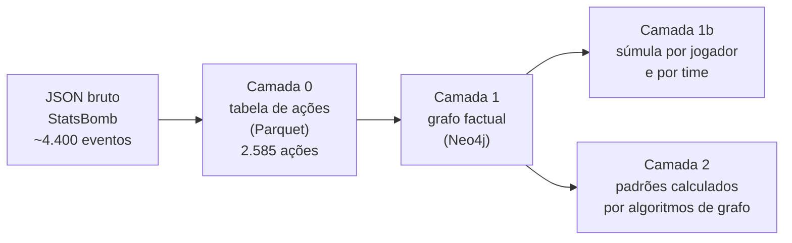

# 2. Dos dados ao grafo: acompanhando o gol de Di María

Este capítulo segue um lance real do primeiro ao último formato: o gol de
Ángel Di María aos 36 minutos da final, depois de um passe de Mac Allister.
Você vai ver o mesmo lance como JSON bruto, como linha de tabela e como parte
de um grafo. No fim fica claro de onde vem cada número que os braços usam.

O caminho completo tem quatro etapas, chamadas de **camadas**:



**Nenhuma camada usa LLM.** Tudo é cálculo determinístico: rodar de novo dá
exatamente o mesmo resultado. O LLM só entra no benchmark, como quem responde
as perguntas.

---

## Etapa 0: o JSON bruto da StatsBomb

A StatsBomb publica dados de partidas no
[StatsBomb Open Data](https://github.com/statsbomb/open-data). Para cada
partida há dois arquivos que o projeto usa:

- `events/3869685.json`: a lista de eventos, em ordem;
- `lineups/3869685.json`: as escalações, com nome completo e apelido de cada
  jogador.

O gol de Di María aparece assim no JSON (resumido aos campos principais):

```json
{
  "period": 1,
  "minute": 35,
  "second": 22,
  "type":   { "name": "Shot" },
  "team":   { "name": "Argentina" },
  "player": { "name": "Ángel Fabián Di María Hernández" },
  "location": [111.8, 32.1],
  "possession": 52,
  "shot": {
    "outcome":   { "name": "Goal" },
    "type":      { "name": "Open Play" },
    "body_part": { "name": "Left Foot" },
    "statsbomb_xg": 0.303
  }
}
```

E o passe de Mac Allister, dois segundos antes:

```json
{
  "minute": 35, "second": 20,
  "type":   { "name": "Pass" },
  "player": { "name": "Alexis Mac Allister" },
  "pass": {
    "recipient": { "name": "Ángel Fabián Di María Hernández" },
    "goal_assist": true
  }
}
```

Três detalhes que vão importar depois:

1. **O nome do jogador é o nome completo de registro**: "Ángel Fabián Di
   María Hernández", não "Di María". Por isso a conferência das respostas
   precisa reconhecer apelidos (capítulo 5).
2. **O campo `minute` conta minutos decorridos**, começando em 0. O gol saiu
   no minuto 35 decorrido, que na transmissão aparece como **36'**.
3. **O JSON é rico, mas irregular.** Cada tipo de evento tem campos próprios
   (`shot`, `pass`, `foul_committed`, `bad_behaviour`...). Contar "quantos
   cartões amarelos" exige saber que o cartão pode vir dentro de
   `foul_committed` ou de `bad_behaviour`. É fácil errar.

---

## Camada 0: de eventos para ações (SPADL)

A camada 0 transforma o JSON numa tabela regular, uma linha por **ação com
bola**, e grava em `data/processed/3869685.parquet` (Parquet é um formato de
tabela compacto, como um CSV mais eficiente).

### O que é SPADL

**SPADL** é um formato padronizado de ações de futebol, criado por
pesquisadores para que dados de fornecedores diferentes fiquem iguais. Ele:

- mantém só ações com bola (passe, condução, chute, desarme, falta...) e
  descarta eventos auxiliares, como "recebeu a bola" e "começou o tempo";
- dá a toda ação os mesmos campos: quem, time, de onde, para onde, tipo,
  resultado (certo ou errado), parte do corpo;
- vira o campo para que **todo time sempre ataque da esquerda para a
  direita**. Assim, "x alto" sempre significa "perto do gol adversário".
  A conversão a partir da `kloppy` entrega o mandante (Argentina) atacando
  para a direita só nos períodos ímpares, com os lados trocando a cada
  período. A camada 0 espelha as coordenadas de início e fim das ações que
  ficariam ao contrário: as do mandante nos períodos pares e as do
  visitante nos ímpares. Um teste confere que toda ação fica no mesmo lugar
  que no JSON bruto (que já vem do ponto de vista de quem age) e que toda
  finalização está no terço de ataque.

Os ~4.400 eventos da final viram **2.585 ações**. A conversão é feita pela
biblioteca `socceraction`, a partir da leitura do JSON pela `kloppy`.

### O lance do gol na tabela da camada 0

Estas são as cinco ações que terminam no gol (colunas resumidas):

| action_id | minuto | jogador | acao | sucesso | zona início → fim | xT gerado | recebedor |
|---|---|---|---|---|---|---|---|
| 706 | 36 | Messi | passe | sim | 41 → 49 | 0,002 | Julián Álvarez |
| 707 | 36 | Julián Álvarez | conducao | sim | 49 → 49 | 0,000 | – |
| 708 | 36 | Julián Álvarez | passe | sim | 49 → 74 | 0,012 | Mac Allister |
| 709 | 36 | Mac Allister | passe | sim | 74 → 92 | **0,184** | Di María |
| 710 | 36 | Di María | finalizacao | sim (gol) | 92 → 91 | 0,000 | – |

As colunas que a camada 0 acrescenta ao SPADL:

- **`acao`, `sucesso`, `minuto`**: o vocabulário do futebol em português. O
  SPADL chama a condução de `dribble` e o drible de `take_on`, o que confunde
  qualquer leitor (inclusive um LLM). Aqui `acao` diz `conducao` ou
  `drible`, `sucesso` é sim ou não, e `minuto` é o da transmissão (36, não
  35). Essas regras ficam em `ingestion/football_semantics.py`, incluindo
  definições como "desarme certo".
- **Zonas**: o campo é dividido numa grade de **12 colunas × 8 linhas = 96
  zonas**, numeradas de 0 a 95 (`zona = coluna × 8 + linha`). A coluna 0 fica
  junto ao próprio gol e a 11 junto ao gol adversário. As colunas 0–3 são o
  terço defensivo, 4–7 o do meio e 8–11 o de ataque. O passe de Mac Allister
  foi da zona 74 (coluna 9, ataque) para a 92 (coluna 11, dentro da área).
- **xT (expected threat, ameaça esperada)**: quanto uma ação aumentou a
  chance de o time marcar nos próximos lances. Cada zona tem um valor de
  ameaça; levar a bola de uma zona fraca para uma forte gera xT positivo. O
  passe de Mac Allister gerou 0,184, o maior do lance, porque colocou a bola
  dentro da área.
- **VAEP**: outra medida de valor da ação, que considera também o risco de
  sofrer gol. É calculada por um modelo de aprendizado de máquina.
- **Fase de posse (`possession_id`)**: um número que agrupa as ações seguidas
  do mesmo time com a bola. As cinco ações acima são da fase 132.

O xT e o VAEP vêm de modelos **treinados uma única vez** nos 16 jogos do
mata-mata da Copa 2022, a final incluída, e guardados em `data/models/`. No
treino do xT, as ações também são postas da esquerda para a direita. O VAEP
espera o formato original do SPADL (mandante para a direita, visitante para
a esquerda) e faz a virada por conta própria, então recebe as ações nesse
formato.

### Uma diferença importante entre o JSON e a camada 0

A conversão para SPADL não é perfeita, e o benchmark encontrou dois casos:

- **Passes tentados**: o SPADL descarta alguns passes do JSON. Enzo Fernandez
  tem 94 passes no JSON e 92 na camada 0. Passes **certos** batem (79 nos
  dois).
- **Defesas do goleiro**: o JSON tem 7 defesas de Lloris ("Shot Saved") e a
  camada 0 tem 8, porque uma saída do goleiro para afastar a bola ("Keeper
  Sweeper Clear", minuto 107) foi classificada como defesa.

Por isso nenhuma pergunta do benchmark depende desses dois números. A regra
do projeto é não mexer nas camadas 0 a 2 nesta etapa, então o problema foi
registrado, não corrigido (capítulo 7).

---

## Camada 1: o grafo factual (Neo4j)

### O que é um grafo, e por que usar um

Um **grafo** é uma forma de guardar dados como **nós** (coisas) e **arestas**
(ligações entre coisas). Em vez de uma tabela com uma linha por passe, o
grafo guarda "Mac Allister → passou para → Di María" como uma ligação entre
dois jogadores.

A vantagem aparece em perguntas sobre **relações**: "quem passa para quem",
"por quem a bola circula", "que trios de jogadores se repetem". Numa tabela,
isso exige cruzar a tabela com ela mesma várias vezes. Num grafo, é seguir
as setas.

O banco usado é o **Neo4j**, consultado com a linguagem **Cypher**. Uma
consulta Cypher parece um desenho do caminho:

```cypher
MATCH (a:Jogador)-[p:PASSOU_PARA]->(b:Jogador {nome: 'Ángel Fabián Di María Hernández'})
RETURN a.nome, count(p)
```

Lê-se: "encontre jogadores `a` que passaram para Di María e conte os passes".

### O que existe no grafo

**Nós** (as "coisas"):

| Nó | O que representa | Na final |
|---|---|---|
| `Partida` | o jogo | 1 |
| `Time` | Argentina, France | 2 |
| `Jogador` | cada jogador que tocou na bola | 34 |
| `Zona` | cada uma das 96 zonas do campo | 96 |
| `FaseDePosse` | cada sequência de posse de um time | 537 |

**Arestas** (as "ligações"):

| Aresta | Liga | Significado | Na final |
|---|---|---|---|
| `REALIZOU` | Jogador → Partida | **cada ação**, com todos os campos da camada 0 (acao, sucesso, minuto, gol, cartão...) | 2.585 |
| `PASSOU_PARA` | Jogador → Jogador | cada passe **certo** com recebedor conhecido | 989 |
| `DEU_ASSISTENCIA` | Jogador → Jogador | o passe que gerou um gol | 2 |
| `FINALIZOU` | Jogador → Partida | cada finalização | 30 |
| `PRESSIONOU` | Jogador → Jogador | cada pressão sobre um adversário com a bola | 301 |
| `MEMBRO_DE` | Jogador → Time | a que time o jogador pertence | 34 |
| `ATUOU_EM` | Jogador → Zona | em que zonas o jogador agiu, e quantas vezes | 1.039 |
| `PARTICIPOU_DE` | Jogador → FaseDePosse | de que posses o jogador participou | 1.300 |
| `PROGREDIU_PARA` | Zona → Zona | a bola avançou de uma zona para outra | 1.018 |

### O lance do gol no grafo

O passe de Mac Allister virou esta aresta (propriedades principais):

```
(Alexis Mac Allister) -[PASSOU_PARA {minuto: 36, zona_origem: 74, zona_destino: 92,
                                     xt_gerado: 0.184, progressivo: true,
                                     fase_posse_id: "3869685:132"}]-> (Ángel Fabián Di María Hernández)
```

E também uma aresta `DEU_ASSISTENCIA` de Mac Allister para Di María, minuto
36. O chute virou uma aresta `REALIZOU` de Di María com `acao: finalizacao`,
`gol: true`, `desfecho: gol`, `terco: ataque`, `corredor: centro`.

**Toda informação do grafo veio de uma linha da camada 0.** O grafo não
calcula nada novo; ele reorganiza a tabela em ligações.

---

## Camada 1b: a súmula pré-calculada

Perguntas como "quem fez mais desarmes certos?" são simples de enunciar, mas
exigem uma decisão escondida: desarme **tentado** ou **certo**? Enzo
Fernandez tentou 9 e acertou 5. Um modelo que conta errado responde 9.

A camada 1b resolve isso fazendo as contagens **uma vez, por código**, e
guardando o resultado como nós `EstatisticaJogador` (um por jogador) e
`EstatisticaTime` (um por time). Cada campo tem um nome que diz exatamente o
que conta: `desarmes_tentados` e `desarmes_certos` são campos separados.

A súmula de Di María, por exemplo:

| campo | valor | significado |
|---|---|---|
| `toques` | 76 | ações com bola de qualquer tipo |
| `passes_certos` / `passes_tentados` | 25 / 29 | |
| `dribles_certos` / `dribles_tentados` | 5 / 8 | tentativas de passar pelo marcador |
| `finalizacoes` | 2 | |
| `gols` | 1 | |
| `assistencias` | 0 | |

As contagens são feitas **pelo próprio Neo4j, em cima das arestas
`REALIZOU`**. Assim a súmula nunca discorda de uma contagem feita à mão no
grafo. A súmula de time traz ainda posse de bola (medida por **tempo** de
posse, não por número de toques), PPDA (intensidade da pressão) e *field
tilt* (domínio territorial). Esses termos estão no
[glossário](08-glossario.md).

**Essa súmula é exatamente o que o braço `stats_in_prompt` recebe**, e é
também o que as ferramentas `player_stats`, `team_stats` e `stat_ranking` do
braço `graph_tools` consultam. Os dois braços partem dos mesmos números.

---

## Camada 2: padrões calculados por algoritmos de grafo

A camada 2 roda algoritmos sobre o grafo, com a biblioteca **GDS** (Graph
Data Science) do Neo4j, e grava os resultados como nós `PadraoTatico`. Dois
desses padrões aparecem no benchmark:

- **`pivo_estrutural`**: o jogador por quem passa o maior número de rotas de
  passe entre os companheiros, medido pela **betweenness centrality**
  (explicada no capítulo 3). Na Argentina, Otamendi; na França, Koundé.
- **`terceiro_homem`**: combinações de três jogadores (A passa para B, B
  passa para C) que se repetem e levam a bola para frente.

**No benchmark, a camada 2 tem um único papel: conferir o gabarito.** Nenhum
braço lê os nós `PadraoTatico`, porque isso entregaria a resposta pronta.
Quando o braço `graph_tools` precisa de um cálculo estrutural, a ferramenta
roda o algoritmo na hora, sobre a mesma rede de passes. O capítulo 3 mostra
como o gabarito é conferido contra a camada 2.

---

## Resumo: de onde vem cada número

| O que o braço usa | Origem |
|---|---|
| tabela de eventos (`events_in_prompt`, `vector`) | camada 0 (Parquet) |
| súmula (`stats_in_prompt`) | camada 1b (Neo4j) |
| ferramentas (`graph_tools`) | camadas 1 e 1b (Neo4j) + algoritmos do GDS rodados na hora |
| gabarito | JSON bruto + camada 0, **nunca o Neo4j** (capítulo 3) |
