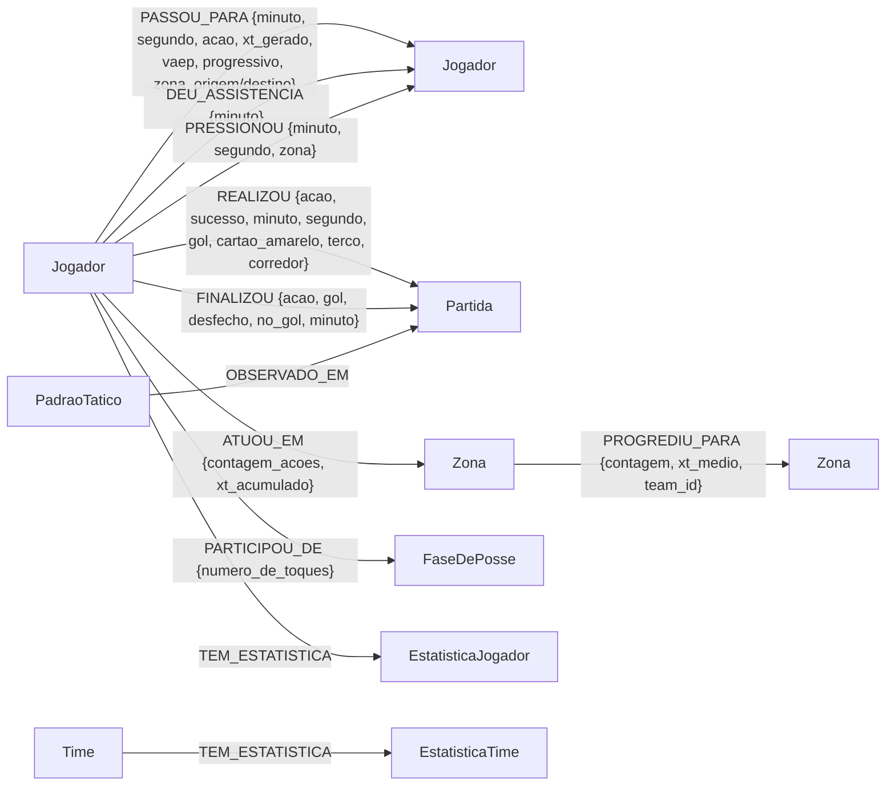

# 02 — Modelo do grafo (Camada 1) e projeções do GDS

Camada factual determinística: cada linha do parquet vira nó/aresta com valores exatos.
Zero LLM (ver ADR-1 em `05-decisoes.md`). Escrita idempotente: nós têm `uid` = uuid5 da
chave natural; arestas fazem `MERGE` por chave (`match_id` + `action_id`/índice).

> **O grafo fala futebol, não SPADL.** Toda ação carrega `acao` em português
> (vocabulário fechado), `sucesso` booleano e `minuto` de transmissão. A
> tradução acontece no passo 0.4h da camada 0 — ver
> `ingestion/football_semantics.py` e a seção 2.6 de `00-entenda-o-projeto.md`.
>
> A versão autoritativa deste schema é **gerada do banco** por
> `graph/schema.py` (é a mesma que vai para o prompt do agente). Para vê-la:
> `python -c "from football_graphrag.config import get_settings; from football_graphrag.graph import db, schema; print(schema.describe_graph(db.make_driver(get_settings())))"`.
> A tabela abaixo é a explicação; o banco é a verdade.

## Schema



## Nós

| Nó | Propriedades | Origem | Compartilhado entre partidas? |
|---|---|---|---|
| `Jogador` | uid, player_id, nome, posicao_nominal, time | escalação StatsBomb | sim (uid = uuid5 do player_id) |
| `Time` | uid, team_id, nome | StatsBomb | sim |
| `Zona` | uid, id_zona (0–95), faixa (defesa/meio/ataque), corredor (esquerda/centro/direita) | passo 0.4a | sim (96 nós fixos) |
| `FaseDePosse` | uid, fase_id "{match}:{posse}", team_id, minuto_inicio/fim, xt_total, zona_inicio/fim, n_acoes | passo 0.4b | não |
| `Partida` | uid, match_id, competicao, times | StatsBomb | não |
| `EstatisticaJogador` | uid, match_id, player_id, nome, time, posicao + as contagens (ver abaixo) | **camada 1b** | não |
| `EstatisticaTime` | uid, match_id, team_id, nome, posse_pct, ppda_1o/2o_tempo, field_tilt_pct + contagens | **camada 1b** | não |
| `PadraoTatico` | uid, tipo, descricao_curta, time, valor_metrica, nome_metrica, **algoritmo_origem**, jogadores_envolvidos, zonas_envolvidas, valid_at/invalid_at | **camada 2** | não |

### A súmula pré-agregada (camada 1b)

`EstatisticaJogador` existe para que perguntas factuais sejam consulta de um
hop, sem agregação escrita na hora e sem decisão ambígua. Os pares
certo/tentado são campos **separados**, de propósito:

`gols`, `gols_de_penalti`, `assistencias`, `finalizacoes`,
`finalizacoes_no_gol`, `passes_certos`, `passes_tentados`,
`precisao_passe_pct`, `passes_progressivos`, `cruzamentos_certos`,
`cruzamentos_tentados`, `conducoes`, `dribles_certos`, `dribles_tentados`,
`desarmes_certos`, `desarmes_tentados`, `interceptacoes`, `cortes`,
`faltas_cometidas`, `cartoes_amarelos`, `defesas_do_goleiro`,
`erros_de_dominio`, `toques`, `pressoes_feitas`, `pressoes_sofridas`,
`xt_total`, `vaep_total`.

As contagens são feitas **em Cypher, sobre as mesmas arestas** que uma
consulta ad-hoc percorreria (`graph/statistics.py`). Assim a súmula não pode
divergir de uma contagem manual — o que seria pior que não ter súmula.
Testado em `tests/test_statistics.py::test_sumula_bate_com_contagem_ad_hoc`.

## Arestas

| Aresta | De → Para | Chave de idempotência | Propriedades |
|---|---|---|---|
| `REALIZOU` | Jogador → Partida | match_id + action_id | **log completo** (uma aresta por ação): acao, grupo_acao, sucesso, minuto, segundo, periodo, periodo_nome, gol, cartao_amarelo, desfecho, no_gol, progressivo, corpo, terco, corredor, zona, xt_gerado, vaep |
| `PASSOU_PARA` | Jogador → Jogador | match_id + action_id | acao, minuto, segundo, periodo, xt_gerado, vaep, progressivo, zona_origem, zona_destino |
| `FINALIZOU` | Jogador → Partida | match_id + action_id | acao (finalizacao/penalti/falta_direta), **gol** (bool), desfecho, no_gol, minuto, periodo, periodo_nome, corpo, zona |
| `DEU_ASSISTENCIA` | Jogador → Jogador (autor do gol) | match_id + action_id | minuto, periodo, periodo_nome — último passe completo da mesma posse recebido pelo autor (pênalti não tem assistência) |
| `PRESSIONOU` | Jogador → Jogador | match_id + pressure_idx | minuto, segundo, periodo, zona |
| `ATUOU_EM` | Jogador → Zona | match_id | contagem_acoes, xt_acumulado |
| `PARTICIPOU_DE` | Jogador → FaseDePosse | match_id | numero_de_toques |
| `MEMBRO_DE` | Jogador → Time | match_id | — |
| `TEM_ESTATISTICA` | Jogador/Time → EstatisticaJogador/EstatisticaTime | derivada | — |
| `PROGREDIU_PARA` | Zona → Zona | match_id + team_id | contagem, xt_medio |
| `OBSERVADO_EM` | PadraoTatico → Partida | derivada | — |

Regra: toda propriedade numérica vem de coluna do parquet sem transformação; as agregações
(`ATUOU_EM`, `PROGREDIU_PARA`, `PARTICIPOU_DE`) são somas/contagens diretas.

### Três convenções que evitam erro de consulta

**`REALIZOU` é a cobertura factual total** (requisito do modo autônomo,
ADR-8): dribles, conduções, desarmes, interceptações, cortes, faltas,
cartões, defesas do goleiro e passes errados — tudo que não tem aresta
dedicada continua consultável, pelo nome em português. As arestas dedicadas
(`PASSOU_PARA`, `FINALIZOU`) são recortes com o nó de destino certo;
`REALIZOU` é o log. **Não somar contagens dos dois.**

**`PASSOU_PARA` não carrega `sucesso`.** Ela só contém passes certos com
recebedor identificado — por construção, um passe só tem recebedor se deu
certo. A propriedade existia e era constante `true`, o que só induzia filtro
inútil; foi removida. Passe errado é
`REALIZOU {grupo_acao: 'passe', sucesso: false}`.

**`minuto` é para ler, `segundo` é para comparar.** `minuto` é o minuto da
transmissão (inteiro, com o período embutido: o 2º tempo começa em 45). Nos
acréscimos os minutos se sobrepõem entre períodos, então ele **não serve para
ordenar nem para janela temporal** — para isso existe `segundo` (contínuo
desde o apito) e `action_id` (estritamente sequencial). Ignorar essa
distinção já causou um bug real no insight 7.3, descrito em
`00-entenda-o-projeto.md`, seção 7.

**`tipo_spadl`** continua em `REALIZOU` como rastro de proveniência, mas
**não é campo de consulta** e é omitido do schema exposto ao agente — expô-lo
reintroduziria a ambiguidade que o projeto removeu (filtrar por `'tackle'` em
vez de `acao = 'desarme'` conta tentativas como acertos).

## Volumes por partida

Contagens de arestas por tipo: `GET /graph/{match_id}/stats`. Medições da execução de
validação (escritas totais e tempos por partida): `07-validacao.md`.

Teste de idempotência: `tests/test_graph_build.py::test_build_is_idempotent`
(constrói duas vezes, compara contagens — passa).

## Projeções do GDS (camada 2)

Cada análise projeta um subgrafo em memória via a função de agregação Cypher
`gds.graph.project(...)` e o descarta ao final (`graph/projections.py`).

### `pass_network(match_id, team, undirected=False)`

- **Subgrafo:** jogadores do time; pares (a,b) com ≥1 `PASSOU_PARA` na partida, agregados.
- **Pesos:** `n_passes` (contagem), `xt_total` (soma de xt_gerado) e
  `cost = 1/(1+xt_total)` — custo para algoritmos de caminho: conexões de maior ameaça
  são caminhos "curtos". (GDS interpreta pesos de betweenness como distância; sem essa
  inversão, mais xT significaria caminho pior.)
- **Serve a:** 7.1 (betweenness, direcionada), 7.4 e 7.5 (Louvain, não-direcionada),
  PageRank de contraste.
- Exemplo real (final, Argentina): 17 nós, 258 arestas agregadas.

### `pressure_network(match_id, pressing_team)`

- **Subgrafo:** pressionadores do time + alvos adversários; arestas agregadas por par.
- **Peso:** `n_pressoes` (contagem por par).
- **Serve a:** 7.8 (`gds.degree.stream` com orientação REVERSE = grau de entrada do alvo).

### Sem projeção (Cypher puro sobre o grafo persistido)

7.2 (padrão de caminho A→B→C), 7.3 (janela temporal pressão×passe), 7.6 (agregação de
fluxo sobre `PROGREDIU_PARA`), 7.7 (série de janelas do parquet + gravação bitemporal).

## Visualização no Neo4j Browser

Com o stack de pé (`docker compose up`), abrir `http://localhost:7474` e usar:

```cypher
// rede de passes da Argentina na final (agregada)
MATCH (a:Jogador)-[p:PASSOU_PARA {match_id: 3869685}]->(b:Jogador)
WHERE a.time = 'Argentina' AND b.time = 'Argentina'
RETURN a, b, count(p) AS passes;

// padrões táticos da final
MATCH (p:PadraoTatico {match_id: 3869685})-[:OBSERVADO_EM]->(m) RETURN p, m;
```

(Os prints para o TCC devem ser gerados dessas duas consultas.)
