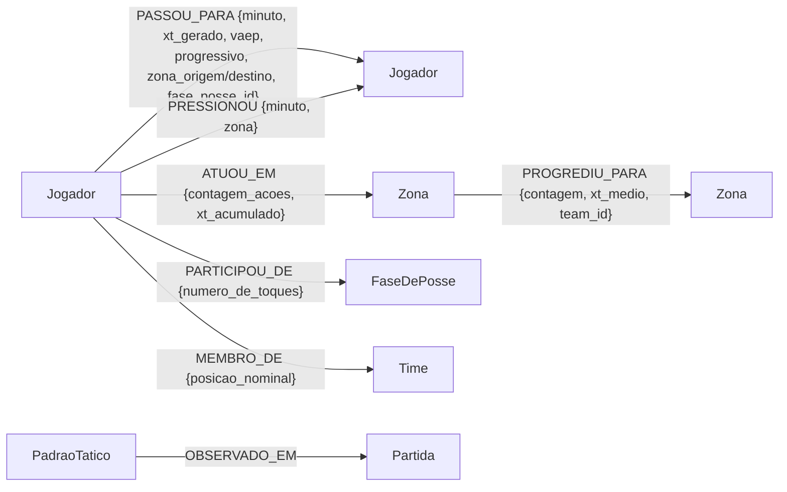

# 02 — Modelo do grafo (Camada 1) e projeções do GDS

Camada factual determinística: cada linha do parquet vira nó/aresta com valores exatos.
Zero LLM (ver ADR-1 em `05-decisoes.md`). Escrita idempotente: nós têm `uid` = uuid5 da
chave natural; arestas fazem `MERGE` por chave (`match_id` + `action_id`/índice).

## Schema



## Nós

| Nó | Propriedades | Origem | Compartilhado entre partidas? |
|---|---|---|---|
| `Jogador` | uid, player_id, nome, posicao_nominal, time | escalação StatsBomb | sim (uid = uuid5 do player_id) |
| `Time` | uid, team_id, nome | StatsBomb | sim |
| `Zona` | uid, id_zona (0–95), faixa (defesa/meio/ataque), corredor (esquerda/centro/direita) | passo 0.4a | sim (96 nós fixos) |
| `FaseDePosse` | uid, fase_id "{match}:{posse}", team_id, minuto_inicio/fim, xt_total, zona_inicio/fim, n_acoes | passo 0.4b | não |
| `Partida` | uid, match_id, competicao, times | StatsBomb | não |
| `PadraoTatico` | uid, tipo, descricao_curta, time, valor_metrica, nome_metrica, **algoritmo_origem**, jogadores_envolvidos, zonas_envolvidas, valid_at/invalid_at | **camada 2** | não |

## Arestas

| Aresta | De → Para | Chave de idempotência | Propriedades |
|---|---|---|---|
| `PASSOU_PARA` | Jogador → Jogador | match_id + action_id | minuto, periodo, xt_gerado, vaep, progressivo, sucesso, zona_origem, zona_destino, fase_posse_id |
| `FINALIZOU` | Jogador → Partida | match_id + action_id | minuto, periodo, tipo (shot/shot_penalty/shot_freekick), resultado, **gol** (bool), zona |
| `DEU_ASSISTENCIA` | Jogador → Jogador (autor do gol) | match_id + action_id | minuto, periodo — último passe completo da mesma posse recebido pelo autor (pênalti não tem assistência) |
| `PRESSIONOU` | Jogador → Jogador | match_id + pressure_idx | minuto, periodo, zona |
| `ATUOU_EM` | Jogador → Zona | match_id | contagem_acoes, xt_acumulado |
| `PARTICIPOU_DE` | Jogador → FaseDePosse | match_id | numero_de_toques |
| `MEMBRO_DE` | Jogador → Time | match_id | — |
| `PROGREDIU_PARA` | Zona → Zona | match_id + team_id | contagem, xt_medio |
| `OBSERVADO_EM` | PadraoTatico → Partida | derivada | — |

Regra: toda propriedade numérica vem de coluna do parquet sem transformação; as agregações
(`ATUOU_EM`, `PROGREDIU_PARA`, `PARTICIPOU_DE`) são somas/contagens diretas.

## Volumes por partida

Contagens de arestas por tipo: `GET /graph/{match_id}/stats`. Medições da execução de
validação (escritas totais e tempos por partida): `07-validacao.md`.

Teste de idempotência: `tests/test_graph_build.py::test_build_is_idempotent`
(constrói duas vezes, compara contagens — passa).

## Projeções do GDS (camada 2)

Cada análise projeta um subgrafo em memória via a função de agregação Cypher
`gds.graph.project(...)` e o descarta ao final (`graph/projections.py`).

### `pass_network(match_id, team, undirected=False)`

- **Subgrafo:** jogadores do time; pares (a,b) com ≥1 `PASSOU_PARA` na partida, agregados.
- **Pesos:** `n_passes` (contagem), `xt_total` (soma de xt_gerado) e
  `cost = 1/(1+xt_total)` — custo para algoritmos de caminho: conexões de maior ameaça
  são caminhos "curtos". (GDS interpreta pesos de betweenness como distância; sem essa
  inversão, mais xT significaria caminho pior.)
- **Serve a:** 7.1 (betweenness, direcionada), 7.4 e 7.5 (Louvain, não-direcionada),
  PageRank de contraste.
- Exemplo real (final, Argentina): 17 nós, 258 arestas agregadas.

### `pressure_network(match_id, pressing_team)`

- **Subgrafo:** pressionadores do time + alvos adversários; arestas agregadas por par.
- **Peso:** `n_pressoes` (contagem por par).
- **Serve a:** 7.8 (`gds.degree.stream` com orientação REVERSE = grau de entrada do alvo).

### Sem projeção (Cypher puro sobre o grafo persistido)

7.2 (padrão de caminho A→B→C), 7.3 (janela temporal pressão×passe), 7.6 (agregação de
fluxo sobre `PROGREDIU_PARA`), 7.7 (série de janelas do parquet + gravação bitemporal).

## Visualização no Neo4j Browser

Com o stack de pé (`docker compose up`), abrir `http://localhost:7474` e usar:

```cypher
// rede de passes da Argentina na final (agregada)
MATCH (a:Jogador)-[p:PASSOU_PARA {match_id: 3869685}]->(b:Jogador)
WHERE a.time = 'Argentina' AND b.time = 'Argentina'
RETURN a, b, count(p) AS passes;

// padrões táticos da final
MATCH (p:PadraoTatico {match_id: 3869685})-[:OBSERVADO_EM]->(m) RETURN p, m;
```

(Os prints para o TCC devem ser gerados dessas duas consultas.)
