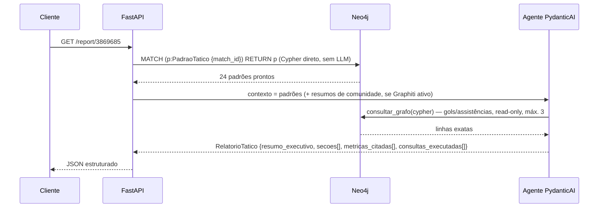
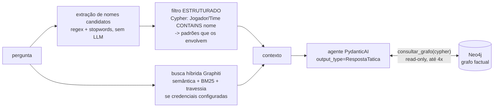

# 04 — Consumo do grafo (Camada 3)

O LLM **nunca calcula**: recebe padrões prontos da camada 2 e verbaliza (relatório) ou
responde (Q&A) com **citação obrigatória** das métricas. Nos dois caminhos ele também
tem **autonomia para percorrer o grafo factual** (ferramenta `consultar_grafo`,
read-only, ADR-8) — o processo completo do modo autônomo está em `08-autonomia.md`.

## Relatório geral — `GET /report/{match_id}`



1. Recupera todos os `PadraoTatico` da partida por Cypher direto — sem busca semântica:
   sabemos exatamente o que queremos.
2. Recupera resumos de comunidade do `build_communities()` do Graphiti (quando indexado).
3. Agente PydanticAI com `output_type=RelatorioTatico`. Cada número citado entra em
   `metricas_citadas` com o `uid` do padrão — é isso que torna a checagem de fidelidade
   determinística (`evaluation/faithfulness.py`).
4. **Ficha factual autônoma:** o relatório abre com a seção "O jogo em fatos" (gols com
   minuto/período, assistências), obtida pelo próprio agente via `consultar_grafo` e
   auditável em `consultas_executadas` (re-executáveis por
   `faithfulness.check_queries`). A regra antiga "não mencione gols" virou "fatos do
   jogo SÓ com consulta registrada".

Cada seção (e cada resposta do Q&A) sai em **dois registros**: `narrativa`/`resposta`
em linguagem tática (tatiquês), e `em_bom_portugues` — a mesma conclusão explicada em
termos do dia a dia, sem jargão, para quem assiste futebol mas não estuda tática.

## Q&A — `POST /ask` `{match_id, pergunta}`



**Modo autônomo (ADR-8):** além dos padrões pré-calculados, o agente tem a ferramenta
`consultar_grafo` — Cypher **somente-leitura** gerado pelo próprio LLM contra o grafo
factual, com o schema do grafo LIDO DO BANCO e injetado como system prompt
dinâmico (`graph/schema.py`). É isso que responde perguntas
factuais que nenhum padrão cobre: gols, assistências, finalizações, contagens de passes,
dribles, desarmes, cartões, duplas, zonas, fases de posse — a aresta `REALIZOU` (log
completo de ações SPADL) garante que **qualquer** ação do jogo tem dado consultável.
Três garantias mantêm a tese de pé:
1. **quem calcula é o Neo4j** (agregação determinística) — o LLM decide *o que*
   consultar, nunca faz aritmética de cabeça;
2. **read-only de verdade**: transação READ do servidor + guarda sintática que recusa
   cláusulas de escrita e `CALL` (procedures), com limite de linhas e timeout
   (`graph/db.py::run_readonly`);
3. **auditabilidade**: cada consulta usada volta na resposta
   (`consultas_executadas`) e é re-executada pela checagem de fidelidade
   (`faithfulness.check_queries`).

**Por que filtro estruturado vem antes de busca semântica:** aprendizado validado por
Heredia (2025): quando a pergunta nomeia uma entidade, resolução por identificador +
travessia bate busca semântica (100% vs 70% de acurácia de recuperação). A busca híbrida
do Graphiti entra como complemento para perguntas conceituais ("como quebravam o bloco
baixo"), nunca como substituto do filtro estruturado. Se nada é recuperado, fallback: todos
os padrões da partida (dezenas, cabem no contexto).

Latência de recuperação e de geração são medidas separadamente e logadas
(`retrieval_seconds` / `generation_seconds`), e entram em `eval_results.json`.

## Endpoints

| Endpoint | Camadas | LLM? |
|---|---|---|
| `POST /ingest/{match_id}` | 0 + 1 | não |
| `POST /analyze/{match_id}` | 2 (+ indexação Graphiti se configurado) | só na indexação/comunidades |
| `GET /report/{match_id}` | 3 | sim (verbalização) |
| `POST /ask` | 3 | sim (geração; recuperação sem LLM) |
| `GET /graph/{match_id}/stats` | — | não |
| `GET /health` | — | não |

`Agent.instrument_all()` no startup (Langfuse OTel, se chaves presentes); um único
`asyncio.Semaphore(SEMAPHORE_LIMIT)` adquirido antes de cada `agent.run()`.

## Prompts de sistema

Os prompts vivem em `api/agents.py` (`PROMPT_RELATORIO` e `PROMPT_QA`) e são
curtos: só papel, fontes e regras de citação. **O schema do grafo não está
escrito neles** — é lido do banco a cada execução por `graph/schema.py` e
injetado como system prompt dinâmico.

Para ver exatamente o que o agente recebe:

```python
from football_graphrag.config import get_settings
from football_graphrag.graph import db, schema
print(schema.describe_graph(db.make_driver(get_settings())))
```

### O que saiu do prompt, e por quê

A versão anterior carregava ~40 linhas de schema escrito à mão, das quais a
maior parte não era schema, e sim aviso sobre armadilha do dado:

| Aviso que existia | Onde foi resolvido |
|---|---|
| "ATENÇÃO à nomenclatura SPADL: `dribble` = condução, `take_on` = drible, `tackle` = desarme" | vocabulário em português no dado (passo 0.4h) |
| "`foul` com resultado `yellow_card` = cartão amarelo" | `cartao_amarelo` booleano na aresta |
| "passes errados: tipo de passe com resultado <> success" | `sucesso` booleano na aresta |
| "minuto reinicia por período (1=1ºT, 2=2ºT...)" | `minuto` já é o minuto de transmissão |
| "NUNCA faça join com FINALIZOU (multiplica linhas)" | contagens prontas em `EstatisticaJogador` |
| "não some contagens de PASSOU_PARA e REALIZOU" | idem, e o schema diz o que cada aresta é |
| "cuidado com joins que multiplicam linhas" | idem |

O motivo de mover tudo isso para o dado é que **prompt falha em silêncio**.
Na avaliação registrada em `07-validacao.md`, o aviso sobre `tackle` estava
no prompt e mesmo assim o modelo respondeu "Enzo fez 9 desarmes" (tentativas)
quando a resposta é 5 (certos) — e na mesma execução acertou os dribles, o
que mostra que a obediência a esse tipo de instrução é probabilística. Um
campo chamado `desarmes_certos` não tem como ser mal interpretado.

Sobrou no prompt o que é regra de comportamento, não de dado: não calcular,
citar `padrao_tatico_id` para toda métrica, registrar cada consulta em
`consultas_executadas`, admitir quando o grafo não tem o dado, e escrever nos
dois registros (`narrativa`/`resposta` em tatiquês e `em_bom_portugues` sem
jargão). Continua lá também o limite do escopo — a disputa de pênaltis não
está no grafo —, porque isso é uma fronteira real dos dados e não uma
armadilha de nomenclatura.

Regra que veio de erro real observado na validação (ADR-8): o modelo completou
"3-3, pênaltis" de memória. A re-execução de consultas não pega esse tipo de
erro, porque não há consulta errada — há texto sem consulta. Por isso a
proibição de completar de memória continua explícita.

## Exemplo real de recuperação (sem LLM)

Pergunta: *"Qual jogador foi o gargalo estrutural da progressão da Argentina na final?"*
(`match_id=3869685`)

1. Nomes candidatos extraídos: `["Argentina", "gargalo", "estrutural", "progressão", "final"]`
2. Entidades resolvidas no grafo: `Argentina` (Time).
3. Padrões recuperados por filtro estruturado (7, entre eles):
   - `pivo_estrutural`: *"Nicolás Otamendi é o gargalo estrutural da progressão de
     Argentina: betweenness 50.0 (2º colocado: 25.0), com 143 ações e pageRank 1.622"*
   - `ligacao_fragil`, `gatilho_pressao`, `mudanca_estado`(4), `terceiro_homem`...
4. O agente responde citando `{padrao_tatico_id: <uid>, nome_metrica:
   "betweenness_centrality", valor: 50.0, algoritmo_origem: "gds.betweenness.stream"}`.

A geração (passo 4) exige chave de LLM no `.env`; a recuperação (1–3) roda sem nenhuma.

## Exemplo real de resposta (os dois registros)

Pergunta: *"Qual jogador foi o gargalo estrutural da progressão da Argentina na final?"*
— resposta real do sistema (`claude-haiku-4-5`, 3/3 citações válidas contra o grafo):

> **resposta (tatiquês):** "Nicolás Hernán Otamendi foi o gargalo estrutural da
> progressão da Argentina na final. Com betweenness centrality de 50.0 (2º colocado:
> 25.0), ele concentrou 47% de todo o fluxo de passes entre os blocos
> defensivo-ofensivo (ligação com Tagliafico)..."
>
> **em_bom_portugues:** "Nicolás Otamendi foi o jogador mais importante para a
> Argentina sair jogando. Todos os passes de progressão passavam por ele — quando você
> olhava para frente, ele estava lá. Se o adversário marcasse nele com intensidade, a
> Argentina ficava travada, porque praticamente todos os caminhos do time iam por
> suas mãos."

Latências e demais medições da validação ao vivo: `07-validacao.md`.

## Que perguntas o sistema responde

Uma pergunta por insight da seção 7 (o golden dataset em
`evaluation/golden_dataset.py` tem 24 — 16 estruturais/agregada + 8 factuais do modo
autônomo — todas com resposta de referência verificada):

| Tipo de pergunta | Exemplo real | Insight |
|---|---|---|
| Gargalo de progressão | "Qual jogador foi o gargalo estrutural da progressão da Argentina?" | 7.1 |
| Combinações recorrentes | "Que trio a Argentina repetiu para quebrar linhas?" | 7.2 |
| Regra de pressing rival | "O que disparava a pressão da Argentina sobre a França?" | 7.3 |
| Onde pressionar | "Onde a França deveria ter pressionado para desconectar a construção argentina?" | 7.4 |
| Papel real vs escalação | "Theo Hernández jogou mesmo como lateral esquerdo?" / "Borna Sosa atuou como lateral na semi?" | 7.5 |
| Lado de construção vs chegada | "A construção da Inglaterra pela esquerda rendia chegada ao ataque?" | 7.6 |
| Mudança de comportamento | "A Argentina mudou de comportamento defensivo durante a final? Quando?" | 7.7 |
| Caça a um jogador | "A Inglaterra caçou algum jogador específico da França?" | 7.8 |
| Métricas agregadas | "Qual time terminou a final pressionando mais alto?" | agregada |
| **Fatos do jogo (modo autônomo)** | "Quem fez os gols?" / "Quem deu as assistências?" / "Qual dupla mais trocou passes?" / "Quem finalizou mais?" | Cypher read-only (ADR-8) |
| **Qualquer ação do jogo (REALIZOU)** | "Quem levou cartão amarelo?" / "Quem mais driblou?" / "Quem fez mais desarmes?" / "Quantas defesas fez cada goleiro?" / "Quem mais errou passes?" | Cypher read-only (ADR-8) |

Com o modo autônomo, qualquer pergunta cuja resposta exista no **grafo factual** é
respondível — o LLM escreve a consulta, o Neo4j calcula. A aresta `REALIZOU` (log
completo de ações SPADL) garante que TODA ação individual do jogo está no grafo:
finalizações/gols, assistências, passes (certos e errados), dribles, conduções,
desarmes, interceptações, cortes, faltas e cartões amarelos, defesas de goleiro,
pressões, zonas, fases de posse, escalação. Continuam **fora do escopo** (resposta
honesta com `confianca=baixa`): disputa de pênaltis (período 5 é excluído da pipeline
por não ser jogo corrido), cartão vermelho direto (o SPADL da StatsBomb não o modela
como ação), lances subjetivos ("foi pênalti?") e partidas não ingeridas.
