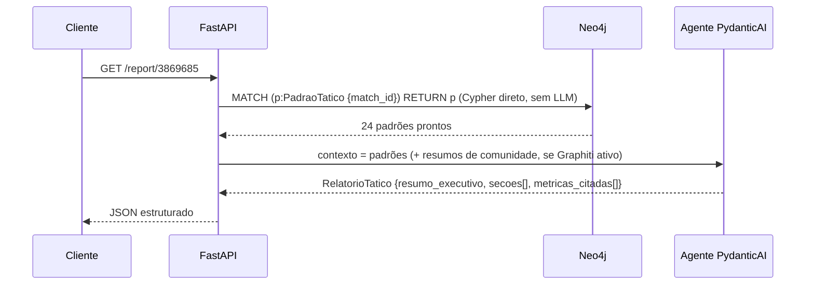
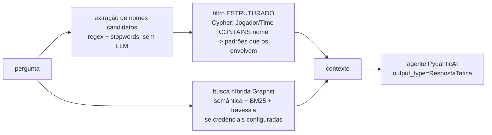

# 04 — Consumo do grafo (Camada 3)

O LLM **nunca calcula**: recebe padrões prontos da camada 2 e verbaliza (relatório) ou
responde (Q&A) com **citação obrigatória** das métricas.

## Relatório geral — `GET /report/{match_id}`



1. Recupera todos os `PadraoTatico` da partida por Cypher direto — sem busca semântica:
   sabemos exatamente o que queremos.
2. Recupera resumos de comunidade do `build_communities()` do Graphiti (quando indexado).
3. Agente PydanticAI com `output_type=RelatorioTatico`. Cada número citado entra em
   `metricas_citadas` com o `uid` do padrão — é isso que torna a checagem de fidelidade
   determinística (`evaluation/faithfulness.py`).

Cada seção (e cada resposta do Q&A) sai em **dois registros**: `narrativa`/`resposta`
em linguagem tática (tatiquês), e `em_bom_portugues` — a mesma conclusão explicada em
termos do dia a dia, sem jargão, para quem assiste futebol mas não estuda tática.

## Q&A — `POST /ask` `{match_id, pergunta}`



**Por que filtro estruturado vem antes de busca semântica:** aprendizado validado por
Heredia (2025): quando a pergunta nomeia uma entidade, resolução por identificador +
travessia bate busca semântica (100% vs 70% de acurácia de recuperação). A busca híbrida
do Graphiti entra como complemento para perguntas conceituais ("como quebravam o bloco
baixo"), nunca como substituto do filtro estruturado. Se nada é recuperado, fallback: todos
os padrões da partida (dezenas, cabem no contexto).

Latência de recuperação e de geração são medidas separadamente e logadas
(`retrieval_seconds` / `generation_seconds`), e entram em `eval_results.json`.

## Endpoints

| Endpoint | Camadas | LLM? |
|---|---|---|
| `POST /ingest/{match_id}` | 0 + 1 | não |
| `POST /analyze/{match_id}` | 2 (+ indexação Graphiti se configurado) | só na indexação/comunidades |
| `GET /report/{match_id}` | 3 | sim (verbalização) |
| `POST /ask` | 3 | sim (geração; recuperação sem LLM) |
| `GET /graph/{match_id}/stats` | — | não |
| `GET /health` | — | não |

`Agent.instrument_all()` no startup (Langfuse OTel, se chaves presentes); um único
`asyncio.Semaphore(SEMAPHORE_LIMIT)` adquirido antes de cada `agent.run()`.

## Prompts de sistema (íntegra)

### Relatório (`api/agents.py::PROMPT_RELATORIO`)

```
Você é um analista tático de futebol. Recebe uma lista de PADRÕES TÁTICOS já
calculados por algoritmos de grafo determinísticos (betweenness, comunidades,
caminhos multi-hop, janelas temporais) sobre o grafo da partida, e opcionalmente
resumos de comunidades de padrões.

Sua tarefa é VERBALIZAR esses achados numa narrativa tática estruturada.

Regras invioláveis:
1. Você NÃO calcula nada. Todo número da narrativa vem de um padrão recebido.
2. Toda métrica mencionada entra em metricas_citadas com o padrao_tatico_id
   (campo uid), nome_metrica, valor e algoritmo_origem EXATOS do padrão citado.
3. NÃO mencione placar, gols nem quem venceu: o relatório é sobre COMO o jogo
   foi jogado, não sobre o resultado.
4. Não invente padrões, jogadores nem valores que não estejam no contexto.
5. Escreva em DOIS registros por seção:
   - narrativa: linguagem tática (tatiquês) — betweenness, PPDA, bloco, corredor,
     linha de passe — explicando POR QUE cada padrão importa e o que um
     treinador faria com essa informação.
   - em_bom_portugues: a MESMA conclusão em termos do dia a dia, sem nenhum
     jargão, como você explicaria para alguém que assiste futebol no bar:
     o que aconteceu em campo e por que isso decidiu alguma coisa
     (ex.: "quase toda jogada da Argentina passava pelo Otamendi; se a França
     tivesse colado um atacante nele, o time ficava sem saída de bola").
Organize as seções por tema (estrutura de construção, pressão, mudanças ao
longo do jogo), não uma seção por padrão.
```

### Q&A (`api/agents.py::PROMPT_QA`)

```
Você é um analista tático de futebol respondendo uma pergunta específica sobre
uma partida. Recebe contexto recuperado do grafo da partida: padrões táticos
calculados por algoritmos determinísticos e, às vezes, fatos factuais do grafo.

Regras invioláveis:
1. Você NÃO calcula nada; responde apenas com o que está no contexto.
2. Toda métrica citada entra em metricas_citadas com o padrao_tatico_id (uid),
   nome_metrica, valor e algoritmo_origem EXATOS.
3. Se o contexto não contém a resposta, diga isso explicitamente e marque
   confianca=baixa. NÃO complete com conhecimento externo sobre a partida.
4. Não mencione placar nem resultado, a menos que a pergunta seja sobre isso
   e o dado esteja no contexto.
Responda em português, direto ao ponto, em DOIS registros:
- resposta: linguagem tática (tatiquês), com as métricas.
- em_bom_portugues: a MESMA resposta em termos do dia a dia, sem jargão,
  como você explicaria para alguém que assiste futebol no bar — o que isso
  significava em campo, na prática.
```

## Exemplo real de recuperação (sem LLM)

Pergunta: *"Qual jogador foi o gargalo estrutural da progressão da Argentina na final?"*
(`match_id=3869685`)

1. Nomes candidatos extraídos: `["Argentina", "gargalo", "estrutural", "progressão", "final"]`
2. Entidades resolvidas no grafo: `Argentina` (Time).
3. Padrões recuperados por filtro estruturado (7, entre eles):
   - `pivo_estrutural`: *"Nicolás Otamendi é o gargalo estrutural da progressão de
     Argentina: betweenness 50.0 (2º colocado: 25.0), com 143 ações e pageRank 1.622"*
   - `ligacao_fragil`, `gatilho_pressao`, `mudanca_estado`(4), `terceiro_homem`...
4. O agente responde citando `{padrao_tatico_id: <uid>, nome_metrica:
   "betweenness_centrality", valor: 50.0, algoritmo_origem: "gds.betweenness.stream"}`.

A geração (passo 4) exige chave de LLM no `.env`; a recuperação (1–3) roda sem nenhuma.

## Exemplo real de resposta (os dois registros)

Pergunta: *"Qual jogador foi o gargalo estrutural da progressão da Argentina na final?"*
— resposta real do sistema (`claude-haiku-4-5`, 3/3 citações válidas contra o grafo):

> **resposta (tatiquês):** "Nicolás Hernán Otamendi foi o gargalo estrutural da
> progressão da Argentina na final. Com betweenness centrality de 50.0 (2º colocado:
> 25.0), ele concentrou 47% de todo o fluxo de passes entre os blocos
> defensivo-ofensivo (ligação com Tagliafico)..."
>
> **em_bom_portugues:** "Nicolás Otamendi foi o jogador mais importante para a
> Argentina sair jogando. Todos os passes de progressão passavam por ele — quando você
> olhava para frente, ele estava lá. Se o adversário marcasse nele com intensidade, a
> Argentina ficava travada, porque praticamente todos os caminhos do time iam por
> suas mãos."

Latências e demais medições da validação ao vivo: `07-validacao.md`.

## Que perguntas o sistema responde

Uma pergunta por insight da seção 7 (o golden dataset em
`evaluation/golden_dataset.py` tem 16, todas com resposta de referência verificada):

| Tipo de pergunta | Exemplo real | Insight |
|---|---|---|
| Gargalo de progressão | "Qual jogador foi o gargalo estrutural da progressão da Argentina?" | 7.1 |
| Combinações recorrentes | "Que trio a Argentina repetiu para quebrar linhas?" | 7.2 |
| Regra de pressing rival | "O que disparava a pressão da Argentina sobre a França?" | 7.3 |
| Onde pressionar | "Onde a França deveria ter pressionado para desconectar a construção argentina?" | 7.4 |
| Papel real vs escalação | "Theo Hernández jogou mesmo como lateral esquerdo?" / "Borna Sosa atuou como lateral na semi?" | 7.5 |
| Lado de construção vs chegada | "A construção da Inglaterra pela esquerda rendia chegada ao ataque?" | 7.6 |
| Mudança de comportamento | "A Argentina mudou de comportamento defensivo durante a final? Quando?" | 7.7 |
| Caça a um jogador | "A Inglaterra caçou algum jogador específico da França?" | 7.8 |
| Métricas agregadas | "Qual time terminou a final pressionando mais alto?" | agregada |

Perguntas **fora do escopo** (o agente responde `confianca=baixa` dizendo que o contexto
não cobre): placar/resultado, lances individuais ("foi pênalti?"), partidas não
ingeridas, e qualquer número que não exista como `PadraoTatico` no grafo — por
construção, o LLM não calcula nada novo na hora da pergunta.
