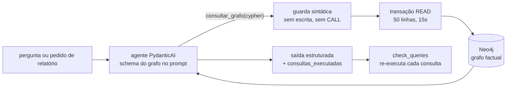

# 08 — Modo autônomo: o processo completo (text-to-Cypher read-only)

Este documento registra o PROCESSO de dar autonomia ao LLM para percorrer o grafo —
decisão, implementação, os bugs reais que a validação encontrou e como cada um virou
regra de prompt ou de código. A decisão resumida está no ADR-8 (`05-decisoes.md`);
aqui está o caminho inteiro, na ordem em que aconteceu.

## 1. O problema

A arquitetura original só respondia o que existisse como `PadraoTatico` (camada 2) ou
estivesse indexado no Graphiti. Perguntas factuais legítimas — "quem fez os gols?",
"quem levou cartão?" — recebiam "não tenho no contexto", embora o dado estivesse (ou
coubesse) no grafo factual. Requisito: **responder TUDO sobre o jogo** — fatos e
tática — em ambos os caminhos de consumo (relatório e Q&A).

## 2. Por que não `graphiti.search` para isso

O `graphiti.search` (busca híbrida: semântica + BM25 + travessia) já é usado no `/ask`
— mas ele só enxerga o que foi **indexado**: as dezenas de `PadraoTatico`. Os ~5.000
fatos brutos por partida não são indexados de propósito (ADR-1: uma chamada de
embedding por fato inviabiliza custo/latência da camada determinística). Busca
semântica também é o instrumento errado para fato exato: "quem fez os gols?" não é
uma questão de similaridade, é um filtro (`gol=true`) — resolvível com exatidão e de
graça por Cypher. Os dois mecanismos são complementares:

| Mecanismo | Enxerga | Bom para |
|---|---|---|
| `graphiti.search` (híbrido) | padrões indexados (dezenas) | perguntas conceituais/táticas ("como quebravam o bloco?") |
| `consultar_grafo` (text-to-Cypher) | grafo factual inteiro (~15k arestas) | fatos exatos, contagens, rankings, qualquer ação do jogo |

## 3. A solução em três invariantes

O LLM ganha a ferramenta `consultar_grafo(cypher)` nos DOIS agentes (relatório e Q&A),
com o schema completo do grafo no prompt de sistema. A tese do projeto ("o LLM não
calcula") sobrevive por três invariantes:

1. **Quem calcula é o Neo4j.** O LLM decide *o que* consultar; contagem, soma e
   ranking são agregação determinística do banco. Métricas continuam nascendo nas
   camadas 0/2; a ferramenta faz recuperação factual, não análise.
2. **Somente-leitura imposto em duas camadas** (`graph/db.py::run_readonly`):
   - guarda sintática: recusa `CREATE|MERGE|DELETE|DETACH|SET|REMOVE|DROP|FOREACH|LOAD CSV`
     e qualquer `CALL` (bloqueia procedures dbms/apoc/gds) antes de tocar o banco;
   - transação `READ_ACCESS` do driver: mesmo que a guarda falhasse, o servidor
     rejeita escrita. Limite de 50 linhas e timeout de 15 s por consulta.
3. **Auditabilidade.** Toda consulta volta na saída (`consultas_executadas`, com
   `cypher` + `resultado_resumido`) e `faithfulness.check_queries` a **re-executa**
   contra o grafo. Um relatório/resposta nunca cita um fato órfão.

## 4. O que o grafo precisou ganhar

Autonomia sem dado é inútil. Duas rodadas de enriquecimento da camada 1 (sempre nas
regras dela: seleção direta do parquet, zero cálculo novo, idempotente):

| Rodada | Arestas novas | Cobre |
|---|---|---|
| 1ª | `FINALIZOU` (com `gol` booleano), `DEU_ASSISTENCIA` | gols, finalizações, assistências |
| 2ª | `REALIZOU` — **log completo de ações SPADL**, uma aresta por ação (tipo, resultado, corpo, minuto, período, zona, xT, VAEP) | TODO o resto: dribles (`take_on`), conduções (`dribble`), desarmes, interceptações, cortes, faltas e cartões amarelos (`foul`/`yellow_card`), defesas de goleiro, passes errados |

Com `REALIZOU`, qualquer ação individual do jogo tem dado consultável — a cauda longa
de perguntas factuais deixou de depender de aresta dedicada.

## 5. Os bugs que a validação ao vivo encontrou (e as regras que viraram)

Cada rodada de validação com o modelo real (`claude-haiku-4-5`) expôs um modo de
falha REAL — nenhum era hipotético. É o argumento central para o processo: prompt de
autonomia se endurece com erro observado, não com paranoia a priori.

| # | Onde | Sintoma observado | Correção |
|---|---|---|---|
| 1 | Q&A | **Vazamento de memória externa**: a resposta dos gols completou "3-3 nos 90 minutos, com pênaltis" — informação que NENHUMA consulta retornou (e errada: 3-3 é o placar de 120 min) | regra de prompt: "você não sabe nada além do grafo", explícita sobre placar agregado e pênaltis |
| 2 | Q&A | **Join que multiplica linhas**: `DEU_ASSISTENCIA×FINALIZOU` virou "Thuram: 3 assistências" (1 assistência × 3 gols do Mbappé) | schema anotado com o anti-padrão + regra de `COUNT(DISTINCT)`/contagem direta de arestas |
| 3 | Relatório | **O MESMO join do bug 2 reapareceu** no agente de relatório na primeira validação dele — prova de que regra de prompt não migra sozinha entre agentes | a regra do "O jogo em fatos" instrui: assistências = listar arestas `DEU_ASSISTENCIA`, NUNCA join com `FINALIZOU` |
| 4 | Relatório | **Atribuição de time de memória**: as consultas de gol não retornavam `j.time`, e a narrativa embaralhou os times ("Argentina... Mbappé aos 12'"; "France respondeu com Messi") | prompt e schema exigem `RETURN j.nome, j.time` nos gols: atribuição vem do grafo |
| 5 | Relatório | **Vazamento no resumo_executivo**: mesmo com a seção factual correta, o resumo abriu com "decidida nos pênaltis após empate em 3 a 3" — de memória, sem consulta | regra 1 explícita de que vale TAMBÉM para o resumo_executivo: não dizer quem venceu, sem placar agregado, sem pênaltis |

A re-execução de consultas (`check_queries`) **não** detecta os bugs 2–4: a consulta
errada roda e retorna linhas. É uma limitação documentada — a detecção veio de
validação humana contra o parquet (golden dataset, categoria `factual`), e a
mitigação é orientação de consulta no prompt + schema anotado com os anti-padrões.

## 6. Validação final (medições em `07-validacao.md`)

- Q&A factual: gols 6/6, assistências 2/2, dupla com mais passes, top passador —
  todos corretos e com re-execução 100%.
- Q&A sobre ações do `REALIZOU` (5 perguntas): cartões amarelos 6/6 com time e
  período certos, dribles (Mbappé 6), desarmes (Enzo Fernández 5), defesas de goleiro
  (Lloris 8 / Martínez 2), passes errados (Molina 16) — todos batem com o parquet,
  1 consulta por pergunta, re-execução 100%.
- Relatório autônomo: abre com "O jogo em fatos" sustentado por ≤3 consultas
  auditáveis (gols com nome+time+minuto+período+pênalti vindos do grafo; assistências
  por listagem direta de arestas); fidelidade das citações de padrão 100% na rodada
  Haiku. A rodada final (pós-correção do bug 5) rodou com `gemini-2.5-flash` trocando
  só o `.env` — sem menção a pênaltis/vencedor no resumo, fatos 6/6 e 2/2 — o que
  também validou ao vivo a troca de provedor.

## 7. Limites honestos

- **Consulta errada que roda certo** continua sendo o risco estrutural do
  text-to-Cypher; o sistema o reduz (schema anotado, regras, `COUNT(DISTINCT)`) e o
  torna auditável (`consultas_executadas`), mas não o elimina.
- Fora do escopo dos dados: disputa de pênaltis (período 5 excluído da pipeline),
  cartão vermelho direto (não é ação SPADL), lances subjetivos, partidas não
  ingeridas. A instrução é responder `confianca=baixa` e dizer que o grafo não tem o
  dado.
- Máximo de 4 consultas por pergunta (3 no relatório): autonomia com orçamento, não
  exploração aberta.
